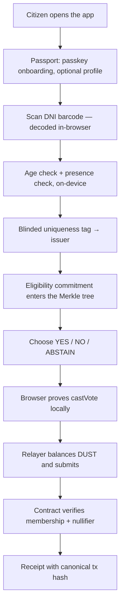

# Referéndum Cívico

**Anonymous, verifiable civic consultation on the Midnight Network.**

A citizen proves they are eligible to vote, votes once, and gets a receipt they
can check — without anyone, including us, being able to link them to their
ballot. No wallet, no browser extension, no seed phrase, no tokens.

Built for Hack Buenos Aires. This is an independent prototype, not an official
referendum.

---

## Passport-v2 status

The repository contains two generations. The original hackathon/DNI contract and its historical Preview transcript remain below as reproducible evidence for the v1 prototype. The active `feat/passport-credential-v2` work replaces country-specific DNI enrollment with a provider-neutral, all-passport architecture:

- Midnight Passport is the session, visible-profile and consent surface.
- Rarimo is a replaceable NFC/passport-evidence adapter behind the CICO issuer.
- `CredentialRegistryV1` issues reusable, issuer-bound credentials; each `ReferendumV2` pins an exact frozen registry root and either a global or country policy.
- The ballot choice, voter secret, holder opening and Compact witness stay in the citizen browser.
- Only the Midnight indexer can turn a submitted transaction into a confirmed receipt.

The complete wallet-less **local demo** is synthetic and labels itself as such. The real Passport-v2 browser action currently uses wallet-derived Midnight providers; an atomic sponsored action endpoint is still pending. The Rarimo boundary now has a hardened self-hosted-verifier adapter, proof-to-enrollment/holder binding, claim validation, durable replay state, and a runnable Preview-only Midnight issuer process with independent fee-wallet and Compact-authority secrets. A pinned/running verificator, funded/deployed registry, physical NFC transcript and hosted credentials are still external gates.

The V1 registry lifecycle is intentionally staged: participants enroll while an epoch is open, the canonical root is reconciled and frozen, and only then do matching consultations open. A later passport scan enters the next epoch rather than pretending to belong to an older frozen root. See [ADR-006](docs/adr/ADR-006-credential-epoch-lifecycle.md).

The official Midnight Passport SDK currently describes itself as planning/spec work with a reduced beta defined. CICO therefore integrates its available profile bridge through `PassportSessionPort` and keeps nationality, age, private-witness and contract-action capabilities behind replaceable ports rather than claiming Passport exposes them today. See [the product roadmap](docs/ROADMAP.md), [deployment gates](docs/DEPLOYMENT.md), and [ADR-001](docs/adr/ADR-001-passport-first-boundaries.md).

Everything under **Live on Midnight Preview** later in this README is v1 evidence. Those transaction IDs do not prove that Passport-v2 enrollment, `CredentialRegistryV1`, `ReferendumV2`, or the new browser journey have run live.

## The problem

Digital civic consultation forces a choice that shouldn't have to be made.

**Centralised platforms** know who voted for what. Even when they promise not
to look, the database exists — and a database that links a citizen to a
political opinion is a permanent liability: subpoenaed, breached, sold, or
quietly used for targeting. Trust rests entirely on the operator's word.

**Public ledgers** fix auditability and break privacy. Put ballots on a chain
and you get a permanent, globally searchable record of who voted how, keyed to
a wallet address that is rarely as anonymous as people assume.

**Blockchain onboarding** excludes the people civic tech most needs to reach.
Install an extension, safeguard a seed phrase, understand gas, acquire tokens —
before casting a single vote. For a municipal consultation aimed at the general
public, this is a non-starter.

And underneath all three: **proving eligibility usually means surrendering
identity.** The normal way to prove you may vote is to hand over your ID
document to whoever is asking.

## The opportunity

Midnight can hold a ledger that is publicly auditable while the data that
produced it stays private. That makes a specific, previously awkward thing
possible: **prove membership in a set of eligible voters, and prove you have
not voted before, without revealing which member you are.**

Argentina makes this concrete. The DNI card carries a PDF417 barcode with the
holder's date of birth and document number — readable by any phone camera, with
no registry integration required. Eligibility can be established on the
citizen's own device, and only a derived, non-reversible tag ever leaves it.

Meanwhile Midnight Passport removes onboarding friction with passkey-based
identity. Combined, they allow the honest pitch: *Passport makes it usable,
Midnight makes it private, and the citizen never installs anything.*

## The solution

Three secrets that never meet.

| | Knows | Never knows |
|---|---|---|
| **Passport identity** | Your display name and profile | Your vote |
| **Voter secret** | That someone eligible voted once | Who you are |
| **Ballot choice** | Joins the public total after the close | Who cast it |

The eligibility check happens on your device. Your vote is sealed as a
cryptographic commitment. A **sponsored relayer** pays the network fee, so you
never need a wallet. The contract accepts the vote because you proved
membership in the eligible set and produced a nullifier nobody has seen —
never because of who submitted it.



### Why a relayer, and not a wallet

Midnight Passport exposes exactly two bridges to third-party apps: a profile
bridge, and a transaction bridge whose only intent kind is
`unshielded-transfer`. Its own specification is explicit — *"No contract calls,
shielded transfers, or batching."* **Passport cannot sign a Compact circuit
call.**

The alternative would be making every citizen install Lace and hold DUST, which
defeats the point. So we took the third path: the referendum contract
authorises `castVote` on **anonymous Merkle membership plus a proposal-scoped
nullifier**, and never on the submitter's identity
([`referendum.compact`](contracts/referendum/referendum.compact)). A funded
relayer can therefore pay for and submit a vote it did not author, and gains no
power over it.

## Features

**Citizen experience**
- Wallet-less voting: no extension, no seed phrase, no tokens.
- Midnight Passport onboarding with per-field consent.
- Real eligibility: camera scan of the DNI's PDF417 barcode, decoded on-device.
- Presence check: a randomised prompt sequence scored from frame motion.
- Spanish civic UI with a plain-language explainer of exactly what is public.
- Local participation receipts with canonical explorer links.

**Privacy and protocol**
- Private commit of YES / NO / ABSTAIN; only aggregates published at reveal.
- Historic Merkle tree for a growing eligibility registry.
- Proposal-scoped nullifiers: one person, one vote, unlinkable across
  referenda.
- Organizer-only close and finalize.
- Document data never uploaded; only a salted, per-referendum uniqueness tag
  leaves the device.
- Voter secrets held in IndexedDB under a non-extractable WebCrypto key.

**Infrastructure**
- Sponsored relayer that balances and submits on the citizen's behalf.
- Deploy and eligibility-issuance scripts for Midnight Preview.
- Origin-pinned, nonce-bound Passport bridge matching the published protocol.

## Tools

| Area | Stack |
| --- | --- |
| Smart contract | Compact 0.31.1, Compact CLI 0.5.1 |
| Chain runtime | Midnight.js 4.1, Compact Runtime 0.16, Ledger v8.1 |
| Relayer wallet | `@midnight-ntwrk/wallet-sdk-*` (facade 4.0.1) |
| Frontend | React 19, TypeScript, Vite 7 |
| Identity | Midnight Passport profile bridge (`org.midnight.passport.profile/v1`) |
| Document scan | PDF417 via native `BarcodeDetector`, ZXing fallback |
| Private state | WebCrypto AES-GCM + IndexedDB |
| Testing | Vitest, Compact simulator — 62 tests |
| Network | Midnight Preview |

## Getting started

### Requirements

Everything runs on Linux or WSL2. The browser may be on Windows; the toolchain
must not be.

- Ubuntu on WSL2, Node 22.22.0 (via `nvm` and the repo `.nvmrc`), npm 10
- Compact CLI 0.5.1 / compiler 0.31.1
- Docker, for the proof server
- For real transactions: a Preview-funded seed for the relayer

Everything is served over `http://localhost`, which both Passport passkeys and
the camera API accept. No HTTPS, tunnel, or hosting account is needed.

### Local demo — no wallet, no funds, no network

```bash
git clone https://github.com/tomasgarro/midnight-referendum-app.git ~/src/referendum
cd ~/src/referendum
nvm install && nvm use
bash scripts/setup-linux.sh
npm run dev -- --host localhost --port 4173 --strictPort
```

Open <http://localhost:4173>. You can walk the whole interface, scan a DNI (or
use the clearly-labelled demo document), and read the explainer. Local mode is
deliberately read-only: **it never fabricates a receipt.**

### Real votes on Preview

Three processes. First the proof server. Two details here cost hours to
diagnose, and both fail in ways that point somewhere else:

- The image is `midnightntwrk/proof-server` — `ntwrk`, not `network`.
- **The tag must match the ledger.** This project uses `ledger-v8@8.1.0`, which
  needs **proof version V2**. A 6.x server speaks only V1 and rejects every
  proof in milliseconds with nothing but `Failed to prove transaction`.
- It must be **published** to the host (`-p`), not merely exposed, or nothing
  can reach it and the failure reads like a wallet fault.

```bash
docker run -d --name referendum-proof-server -p 127.0.0.1:6300:6300 \
  --restart unless-stopped midnightntwrk/proof-server:8.1.0 \
  -- midnight-proof-server -v
```

Verify before going further — this check is worth the five seconds:

```bash
curl -s http://localhost:6300/version && curl -s http://localhost:6300/proof-versions
```

Expect `8.1.0` and `["V2"]`.

Then the relayer. Generate its seed yourself; `relayer/.env` is gitignored and
the seed is never logged or returned by any endpoint:

```bash
cp relayer/.env.example relayer/.env
node -e "console.log(require('crypto').randomBytes(32).toString('hex'))"   # → RELAYER_SEED
npm run relayer:address     # prints the address to fund
```

Send Preview tNIGHT to that address from the
[test faucet](https://midnight.network/test-faucet), then register it for DUST
generation:

```bash
npm run relayer:dust
```

NIGHT alone cannot pay a fee. DUST pays, and DUST is generated by NIGHT that
has been registered for it — only the UTXO owner can sign that registration,
so the relayer must do it itself.

Then start the relayer and deploy. The relayer must already be running when you
deploy — the script asks it for its DUST balance and routes the deployment
through it rather than starting a second wallet on the same seed:

```bash
npm run relayer             # 127.0.0.1:8790 — leave this running
```

In a second terminal:

```bash
npm run deploy:preview      # writes the contract address into ui/.env
```

Set `VITE_APP_MODE=preview` in `ui/.env`, confirm `VITE_RELAYER_URL` points at
the relayer, and start the UI:

```bash
npm run dev -- --host localhost --port 4173 --strictPort
```

Open **http://localhost:4173** — `localhost`, never `127.0.0.1`. Passport
treats `localhost` as a secure origin and rejects `127.0.0.1` outright.

### Verify

```bash
npm test        # 62 tests: 3 contract simulator, 1 api, 58 ui
```

## Privacy model

**Public on-chain:** that a valid vote was cast; a nullifier preventing a
second one; the YES/NO/ABSTAIN totals after the close.

**Never leaves the device:** your name, document number and photograph; your
choice while voting is open; any link between your identity and your ballot.

**What the relayer sees:** the proven transaction — which carries the nullifier
and the sealed commitment — and your IP. It cannot read your choice, and cannot
tell which eligibility leaf you used, because membership is proved in zero
knowledge. It can refuse to submit, which is a liveness risk, not a privacy
one.

**What the proof server sees:** the witness, meaning your voter secret and your
choice. This is why it must run on your own machine.
`VITE_MIDNIGHT_PROOF_SERVER_URL` pointing at someone else's host hands them the
ballot in plaintext.

**What this does not prove:** reading a barcode proves possession of a
document's data, not that the document is genuine — that needs the chip and
RENAPER. The presence check defeats a held-up photograph; it is not a biometric
match against the document, and not proof against a prepared video replay. The
contract has not been audited.

---

## Status and what remains

Honest accounting, so a human or an AI agent can pick this up and know exactly
where the edges are.

### Live on Midnight Preview

| | |
| --- | --- |
| Contract | `71644dd931b8f862119f78c57fd1cc9d8f3601a7a1e892de414c77db24aecd38` |
| DUST registration tx | `0034a5b1b8d5a004b49fb84d7af0bf177b8ba16ef6a741e95673fa4660a2503f3f` |
| Eligibility issued tx | `48fbbfa5c27ffb12f0573bce353dd172b0030e91ab860daf5243437bb3e873df` |
| **`castVote` tx** | `31882c56d7d7589c20abf4a832e4a9c106c648345baa24de860ea67bdfd0f440` |

The deployment went out **through the relayer**, so it is also proof of the
whole sponsored path: the browser-side provider set balanced an unbound
transaction against the relayer's coins, proved it on a local proof server,
and submitted it. No wallet was involved at any point.

A real ballot is now on chain. `castVote` landed in block 331474 with status
`SucceedEntirely`, authorised purely by Merkle membership and the nullifier —
the submitting relayer is not the voter and cannot be linked to the ballot.
Two follow-up checks confirm the contract is actually enforcing what it claims:

- Re-running the same secret is rejected on chain with
  `failed assert: This voter has already voted in this referendum` — the
  nullifier prevents double voting.
- A secret that was never issued fails before any proving with
  `This wallet is not present in the referendum eligibility tree`.

Reproduce it with [`scripts/cast-vote-e2e.mjs`](scripts/cast-vote-e2e.mjs).
The tally reads `phase: COMMIT` with an empty `tally` — correct for
commit–reveal, since ballots stay hidden until the organizer reveals them.

### A referendum counted end to end

The demo contract above is deliberately left open, so a second referendum was
deployed to carry the whole lifecycle through to a result on Preview:
`2c25fabe2d223de25b72247f365f17e5bc8370aeb6ad73826fb7cc1cb6ff757b`.

| Step | Transaction |
| --- | --- |
| Issue voter A | `c50d8c5df1163ebe123fd7abcdae003c8e7bcfab7c5d6f9dd341e1b49505424b` |
| Issue voter B | `3bf2f52bd883e434a30aee54ed742eb269ea512cde8271e2ee953516992d2709` |
| Ballot A (YES) | `a22c248500f7ccf0b0a152a24eb4bf8fa0724c6e5eb68194995107a7711cc543` |
| Ballot B (NO) | `705321806a191b8d27a63326dad263aea6a01fe4a9fbf2d7915b8c7060251080` |
| Reveal YES | `ce04e8aef6541e9fc54ed57724555eb4e68f94311fa0ebec2bce47e7ddf044eb` |
| Reveal NO | `4b1bb5f2e7d2073df3cd11719c2ef5d0844d98b21a193cc9c6d16d1a02b1a8b1` |
| Finalize | `0c8106db033f8b4bc4fa6b313bbb63770540f6dbc76743becba3cd61b2b1bb42` |

Final on-chain state: `phase=FINALIZED`, `YES=1 NO=1 ABSTAIN=0`. The tally was
empty until the reveals, which is the commit–reveal property holding on a real
chain rather than in the simulator. Counting is driven by
[`scripts/count-referendum.mjs`](scripts/count-referendum.mjs) and is CLI-only
— the organizer console is still the top item in *To build next*.

### Working and verified

- [x] Contract deployed to Preview and readable through the indexer.
- [x] Relayer funded, DUST-registered, and serving `/health`, `/keys`,
      `/balance`, `/submit` — CORS-restricted, input-validated.
- [x] Compact commit/reveal contract; simulator covers double-vote, replay
      reveal, and organizer-only finalize.
- [x] Passport profile bridge conformant with the published protocol —
      embedded-mode handshake adoption, 180 s budget, closed-popup detection.
- [x] DNI PDF417 parsing, age check, salted uniqueness tag, presence scoring
      (34 unit tests), with a camera-free demo-document path.
- [x] Live tally read from the contract; no hardcoded figures.
- [x] Local read-only mode that cannot fabricate a receipt.
- [x] 62 tests; all three workspaces typecheck.
- [x] **A real `castVote` on Preview**, with double-vote and ineligible-voter
      rejection both observed on chain (see above).
- [x] **A referendum carried all the way to a result on Preview** — deploy,
      issue, two ballots, close, reveal, finalize (see below).

### Not yet verified

- [ ] **`castVote` from the browser.** The vote above was proved and submitted
      from Node against the same providers, relayer, and proof server the UI
      uses; the browser path shares that code but has not itself put a ballot
      on chain.
- [ ] **The camera path against a physical DNI.** Parsing is unit-tested
      against synthetic payloads; live PDF417 decoding has not been run, and
      ZXing thresholds will likely need tuning. Needs a phone on
      `http://localhost:4173`.
- [ ] **The browser-side relayer path.** `/balance` and `/submit` are proven
      from Node during deploy, not yet from the browser.

### The relayer is a single-coin bottleneck

Worth knowing before a demo, because it looks like a contract bug and is not.
The relayer holds one DUST coin. Balancing spends it and produces change, but
the wallet only sees that change once it observes the block, so a second
submission sent in the meantime spends a coin the chain already consumed and
the node rejects it with `Invalid Transaction: Custom error: 170`
(`InvalidDustSpendProof`). The next call then finds `availCoins=0` and fails
with `Insufficient Funds: could not balance dust`, and DUST does not come back
on its own: the wallet has locally marked the coin spent for a transaction
that never landed, so it takes a relayer restart to re-derive state from chain.

Space submissions out by a block, or restart the relayer if it reports
`dustBalance: 0` while still holding NIGHT. A production relayer would
serialize submissions behind confirmation of the previous change, and hold a
pool of coins rather than one.

### To build next

1. **Organizer console** — `closeVote`, `revealVote`, `finalizeVote` exist in
   the contract and executor but have no UI. Without it a referendum can be
   voted in but never counted. Start at
   [`api/src/index.ts`](api/src/index.ts) `createReferendumExecutor`.
2. **Verificá should query the indexer.** Preview receipts are currently
   session-only and choice-free; persistence remains disabled until encrypted
   IndexedDB key management is designed. Verification must resolve the network
   and transaction ID against the canonical indexer. See `VerifyView` in
   [`ui/src/App.tsx`](ui/src/App.tsx).
3. **Results presentation** — reveal-phase timing and a finalized-result view.
4. **Issuer service.** `--issue` is operator-run; the uniqueness tag needs a
   real endpoint that enforces one registration per document.
5. **Recovery.** A voter secret lost with browser storage is a lost vote;
   private-state export is deliberately disabled pending a design.
6. **Rarimo / Blockenfy adapters** stay disabled until a tested Midnight
   attestation verifier exists.
7. **Security review** of the contract, the relayer trust boundary, and the
   browser private-state model before this is described as production civic
   infrastructure.

See [DEVELOPMENT.md](DEVELOPMENT.md) for the working setup and
[relayer/README.md](relayer/README.md) for the relayer's trust boundary.

## License

Apache 2.0. See [LICENSE](LICENSE).
