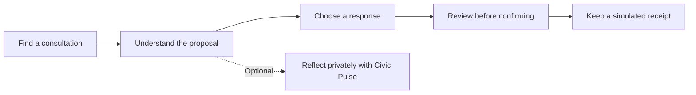

# midnight.vote

**Understand more. Disclose less. Participate as yourself.**

midnight.vote is a Passport-first civic participation project built on Midnight. Its vision brings together **selective disclosure**, **verified citizen participation** and **AI-assisted understanding**: prove that you meet a participation rule without handing over your whole identity, understand the proposal, then make your own choice.

**Submission status:** a working simulated product and reviewable Compact contracts and integration services. Midnight Passport is in its stagenet-beta phase; the physical NFC-to-counted-vote journey is an integration milestone, not a completed public deployment. Consultations are non-binding.

[Try midnight.vote](https://midnight.vote) · [Public Docs](https://midnight.vote/docs) · [Submission brief](docs/SUBMISSION.md) · [Run locally](docs/QUICKSTART.md) · [All documentation](docs/README.md)

## The four pillars

| Pillar | What we are building | What exists today |
| --- | --- | --- |
| **Midnight Passport at the core** | Privacy on your own terms: prove 18+ without a name, or citizenship without a residential address. | Session/profile integration; selective-proof experience remains in progress. |
| **Real passport → NFC → ZK attestation** | Count participation by real, eligible citizens while keeping identity evidence separate from ballots. | Rarimo evidence and issuer adapters; public participation is simulated. |
| **AI for informed deliberation** | Browse sources, simplify dense proposals and understand different perspectives. | Authored, source-linked catalogue guidance; generative AI is planned. |
| **Midnight.city exploration** | Research how AI agents might participate in civic experiments. | Exploratory; separate agent and human result lanes are a design requirement. |

The registry and referendum contracts already use **Compact**. The future migration concerns passport verification now approached through Rarimo; it is a separate engineering challenge.

Read the [project vision](docs/VISION.md), [Passport and proof model](docs/PASSPORT-AND-PROOFS.md), and [AI and deliberation plan](docs/AI-AND-DELIBERATION.md).

## The participant experience

Explore a question that affects your community. Read the proposal and its sources. Ask for context, reflect on the tradeoffs, and review your response before confirming it.

The demo works in English, Spanish and French. **Ask Midnight currently provides authored catalogue answers**, not generated AI responses. **Civic Pulse keeps answers in memory** and does not submit them. Demo credentials and receipts are explicitly labelled as simulated.

## What works today

Status baseline: **16 September 2026**, application source from merged [PR #35](https://github.com/tomasgarro/midnight-vote/pull/35). The [documentation release record](docs/releases/2026-09-16-final-documentation.md) records this release separately from historical deployment evidence.

| Capability | What you can inspect | Evidence level |
| --- | --- | --- |
| Discover, onboarding, guidance and reflection | A complete mobile demo with multilingual copy | Working demo |
| Review and receipt | A deliberate confirmation followed by a local simulated receipt | Working demo; no chain transaction |
| Credential Registry V1 | Issuer-authorized admission of commitments to eligibility claims | Compiled and simulator-tested source |
| Referendum V2 | Eligibility checks, repeat-use prevention, ballot commitment, reveal and tally | Compiled and simulator-tested source |
| Passport session | Account consent and display-profile integration | Source plus a dated [real-session record](docs/evidence/passport-live/2026-08-31-first-real-session.md) |
| NFC verification and live participation | Provider, issuer, relay and receipt interfaces | Integration source; physical end-to-end acceptance pending |
| Generative AI and Swiss parliamentary explanations | Proposed source-grounded research companion | Planned |

## Three things that should stay separate

| Concept | In everyday language | What it does not establish by itself |
| --- | --- | --- |
| Midnight Passport session | How you enter the application and consent to profile sharing | Permission to vote |
| Identity-document evidence | A verification process for facts from a supported document | A unique, live human or freedom from coercion |
| Eligibility credential | Evidence that the holder meets a consultation's published rule | Eligibility for every other consultation |

For example, a Swiss citizens' consultation may require citizenship and an age threshold. A local residents' consultation needs separate evidence of residence. A zero-knowledge proof can establish a defined rule without publishing all its private inputs; the rule itself can still reveal a fact about the participant.

Read the [illustrated explanation](docs/HOW-IT-WORKS.md) for the intended NFC-to-Midnight path and the [architecture](docs/ARCHITECTURE.md) for implementation responsibilities.

## The privacy boundary

The current contract uses **commit–reveal**: the choice is hidden during commit and **becomes public during reveal**, when the tally updates. This is not permanent secret-ballot confidentiality. A receipt that omits the choice does not make the underlying reveal private.

The issuer and accepted-root publisher remain trusted roles. Repeat-use prevention applies to the same bound secret in the same consultation; it does not prove one person across all documents. The [Compact review](docs/COMPACT-REVIEW-2026-09-16.md) explains the implementation, remaining risks and live-release gates.

## Run and review

Start with the [quick start](docs/QUICKSTART.md). A clean source build needs Linux or WSL, Node from [`.nvmrc`](.nvmrc), npm 10 and Compact toolchain 0.31.1 because generated contract assets are not tracked. The resulting **demo** needs no wallet, funds or physical document.

For a submission review, follow this route:

1. [Submission brief](docs/SUBMISSION.md): contribution, walkthrough and evidence.
2. [Product specification](docs/specs/PRODUCT-SPEC.md): requirements and acceptance scenarios.
3. [How it works](docs/HOW-IT-WORKS.md): participant journey and privacy boundaries.
4. [Verification record](docs/releases/2026-09-16-final-documentation.md): exactly what was checked.
5. [Roadmap and release plan](docs/SUBMISSION-PLAN.md): measurable next steps.

## Repository map

| Directory | Responsibility |
| --- | --- |
| [`ui/`](ui/) | Participant experience, local state and simulated journey |
| [`contracts/`](contracts/) | Compact credential registry and referendum rules |
| [`api/`](api/) | Domain interfaces, witnesses and network adapters |
| [`cico-service/`](cico-service/) | Verification boundary and credential issuance |
| [`relayer/`](relayer/) | Authorized transaction submission and confirmation |
| [`scripts/`](scripts/) | Build, deployment and evidence procedures |
| [`docs/`](docs/) | Specifications, decisions, reviews and dated evidence |

Changes start with a [small specification](docs/specs/CHANGE-TEMPLATE.md) and follow the [contribution guide](CONTRIBUTING.md). Historical evidence remains available with its original source revision and environment.

## License

[Apache 2.0](LICENSE).
