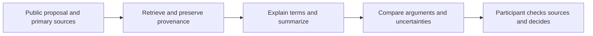

# Understanding before participation

[Documentation](README.md) · [Vision](VISION.md)

Deliberative democracy requires more than recording a preference. People need to understand the issue, examine evidence, recognize tradeoffs and understand why someone else might disagree. midnight.vote's AI vision is to turn dense public material into accessible, useful context while leaving the decision with the participant.

## Today: a source-linked catalogue guide

Ask Midnight currently returns authored answers from the published consultation catalogue, with contextual suggestions and source links. It does not browse the web or call a generative model. PR #35 improves conversation scrolling and proposal context; it does not introduce an AI backend.

Civic Pulse is an optional reflection experience. Its answers stay in component memory. It is not a submitted ballot, a public opinion poll or a training-data collection feature.

## Planned: a research and summarization companion

Useful capabilities include plain-language proposal summaries, explanations of unfamiliar terms, side-by-side arguments, multilingual access and follow-up questions grounded in cited public material. A Swiss parliamentary use case is a proposed starting point, not a completed integration.

## Requirements before enabling generative AI

| Requirement | Acceptance evidence |
| --- | --- |
| Traceable claims | Every substantive factual answer links to supporting sources and their dates. |
| Faithful summaries | Evaluation checks numbers, quoted positions, omissions and source entailment. |
| Uncertainty | Unsupported questions produce an explicit limitation or abstention. |
| Fair treatment | Evaluate competing positions and avoid presenting a model's preference as a civic recommendation. |
| Participant privacy | Document model/provider data flows, retention and consent; keep identity evidence and private ballot material out of prompts. |
| Untrusted source handling | Retrieved text cannot override system instructions or authorize actions. |
| Human agency | The assistant cannot cast a ballot or convert a conversation into a vote. |

No deployed generative capability or evaluation score is claimed by this submission.

## Midnight.city and agents

AI agents participating in Midnight.city are an exploratory direction. Potential research includes comparing simulated deliberation, testing proposal explanations and observing how agent behavior differs from human participation. No live Midnight.city agent-voting integration is submitted here.

Agent results must use a separate actor lane, explicit provenance and separate displays. They must never be merged into verified-human vote totals or substituted when human results are unavailable. The existing [actor-lane decision](adr/ADR-008-civic-pulse-and-actor-lanes.md) and consultation interfaces provide a foundation for that separation.
