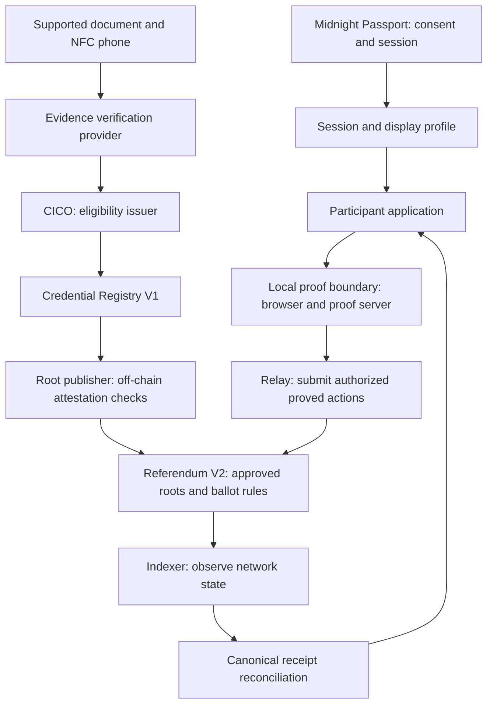

# Passport-first v2 architecture

This document is the ownership map for the active product and target runtime.
It deliberately separates account consent, civic eligibility, action authority,
and public receipt resolution. A value crossing one boundary is not authority
in another. Recorded 2 September evidence establishes an earlier-SHA Preview
registry and referendum deployment, issuance, and root attestation, but no
citizen vote or current-source runtime transcript. The preserved `abdd0a2`
transcript remains older frozen-enrollment evidence. See the [dated release
record](releases/2026-09-16-submission-candidate.md), [ADR-007](adr/ADR-007-open-enrollment-and-evidence-roles.md),
and [ADR-008](adr/ADR-008-civic-pulse-and-actor-lanes.md).

## Runtime boundaries

Read this map as a division of responsibility: signing in, checking eligibility, authorizing an action and confirming its result are separate operations. The working demo substitutes explicitly simulated eligibility and receipts. The full live composition below still needs current-release end-to-end evidence.

The root publisher is a trust boundary: the service checks registry attestation, while the referendum contract checks publisher authority. The contract does not independently prove a root came from the intended registry. The configured local proof server sees witnesses and therefore belongs inside the private computing boundary.

For a step-by-step explanation, see [How it works](HOW-IT-WORKS.md). For reviewed limitations, see the [Compact review](COMPACT-REVIEW-2026-09-16.md).

### Reflection stays outside voting

Answers stay in component memory. This path does not issue credentials, call ballot contracts or publish results. Future agent experiments require a separate actor lane and cannot fall back into human results.

## Package and service ownership

| Boundary | Owner | May receive | Must never receive |
| --- | --- | --- | --- |
| Web product | `ui/` | consented Passport display fields, public catalog/state, encrypted local holder state, local proof result | Passport recovery secret, raw MRZ/NFC/provider evidence |
| Local civic pulse | `ui/src/pulse/`, `api/src/pulse/` | fixed questionnaire and in-memory human-lane draft | network submission, browser persistence, ballot calls, credentials, synthetic-agent answers |
| Consultation results | `api/src/consultation/` | aggregate-only snapshot with lane, mode, version, status, and provenance | raw responses or cross-lane fallback |
| Domain and Midnight adapters | `api/` | provider-neutral port requests, public contract state, witness material inside the local boundary | UI presentation policy or relay fee keys |
| CICO issuer | `cico-service/` | opaque verified evidence authorization, minimum claims, private holder commitment | ballot choice, holder secret/blind, Passport profile, raw document payload |
| Walletless relay | `relayer/` | one-time action capability, proved transaction, allowlisted runtime identifiers | unproved witness, Passport profile, eligibility claims, ballot choice, MRZ/NFC data |
| Compact contracts | `contracts/` | issuer-bound leaf/root, public policy, proof-validated action | names, document data, Passport account/profile, clear ballot opening before reveal |
| Operator/deployment | `scripts/`, runtime manifest | public artifact digests, endpoints, addresses, transaction IDs, DUST observations | browser holder material or Passport recovery data |

## Stable interfaces

- `PassportSessionPort` handles only official account/session/profile consent.
- `PassportHolderBindingPort` returns a verified signed challenge or scoped
  grant when the official capability exists, and `unsupported` otherwise.
- `CivicCredentialPort` hides synthetic, Rarimo, or future Passport-native
  evidence and issuance transports.
- `CivicActionPort` hides the walletless relay and the secondary Lace path.
- `CanonicalReceiptResolver` treats indexer observation—not submission—as the
  source of receipt truth.
- `RuntimeManifest` pins network, artifact versions, contracts, policies, and
  service endpoints for one reproducible environment.
- `PriorityPulsePort` is separate from ballot/action ports and v1 has only a
  non-persistent local demo adapter.
- `ConsultationResultPort` requires actor lane, evidence mode, and provenance;
  missing or cross-lane data fails closed.

## Active and compatibility paths

The active path is Credential Registry V1 plus Referendum V2, selected from a
versioned runtime catalog. Enrollment is open during the published window: the
referendum pins its initial root and admits later roots only through the
attested root-publisher path. Legacy referendum v1 code, its single-contract
reader, `/balance` and `/submit`, and `VITE_MIDNIGHT_CONTRACT_ADDRESS` are
compatibility-only. No active v2 screen may fall back to them. Public v2
catalog and referendum state remain readable without Passport, a civic
credential, or a wallet; the user-facing fallback is synthetic and labelled.

## Security invariants

1. Passport profile data is display/session data, never a credential or vote
   input.
2. Evidence authorization is opaque and single-use; CICO persists only the
   minimum derived claims needed for issuance.
3. Holder material is generated and encrypted in the browser boundary.
4. Proof creation uses a local boundary that includes the configured proof server,
   which sees witnesses. This is not browser-only computation or evidence that
   the full Undeployed or Preview product path is live.
5. The relay accepts only already-proved, allowlisted work and reserves DUST
   transactionally.
6. A relay acknowledgement is pending state. Only an indexer observation can
   create a canonical confirmed receipt.
7. The Passport-to-holder link is never inferred from a name, address, or
   profile field.
8. A citizen credential can authorize only `castVote`; issuer and organizer
   circuits require separate role-bound capability issuers even if a relay
   allowlist is misconfigured.

9. Passport currently supplies session/consent/profile data only. Rarimo is a
   temporary NFC evidence adapter behind the issuer boundary; neither is a
   wallet, recovery, biometric, ETH, or arbitrary-action authority.
