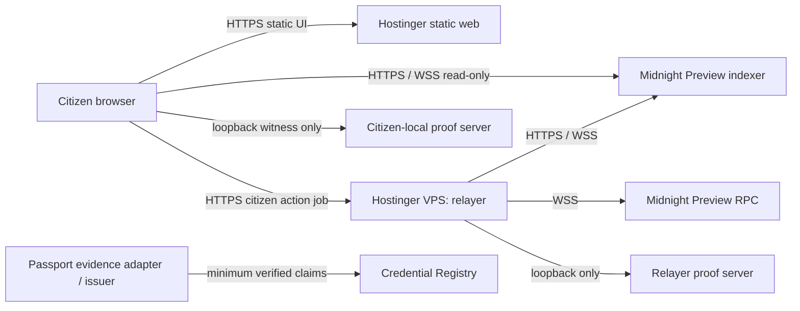

# Deployment topology

Status: target topology for the synthetic release and a later hosted Passport
Preview pilot. The checkout contains source paths for the CICO evidence/issuer
process and capability-gated v2 relay. A prior local Undeployed lifecycle is
preserved as historical evidence at
[docs/evidence/undeployed-v2/abdd0a2/](evidence/undeployed-v2/abdd0a2/)
(manifest digest `d2cb84585d41f76dace23fed49c780e451cc4883efc7b7b5314a9e6d2544e21d`).
That record is SHA-specific and uses the older frozen-enrollment model; it is
not evidence for the current branch. No Preview deployment, Passport origin
approval, physical NFC evidence, hosted URL, CI result, or release identity is
asserted. A pinned/running self-hosted verificator, funded issuer wallet,
deployed open registry, and physical NFC transcript remain external deployment
dependencies. The legacy `/balance` and `/submit` routes remain
compatibility-only and **must not be published as the citizen action API**.

This plan implements ADR-001 through ADR-007:

- Midnight Passport remains the durable consent/session surface; Rarimo is a
  replaceable evidence adapter.
- The browser owns the voter secret, ballot choice, credential opening and
  proving witness.
- A proof endpoint receiving a witness is loopback or an explicitly approved
  Passport provider, with a visible in-product disclosure.
- The Midnight indexer—not browser storage or a relayer response—is the source
  of truth for a confirmed receipt.
- Issuer, organizer and relayer identities use independent key material.
- Raw Rarimo proof data terminates at the restricted backend verifier. The
  browser accepts only request-bound minimal evidence and canonical issuance
  data. Holder/voter material and ballot choice remain browser-owned.
- Open enrollment is the current model; a referendum records its initial root
  and admits later roots only through separately attested root publication.
- Profile/Vault wallet, recovery, biometric, and ETH capabilities are optional
  post-Preview work, not prerequisites for the voting-first release.

## Service boundaries



`api/` is a browser/client TypeScript SDK, not a server to deploy. `cico-service/`
is the separate Node HTTP façade and Preview issuer process. It deliberately
exposes no vote endpoint. The
Vite UI is static output. The browser connects directly to the canonical
Preview indexer; neither Hostinger static web nor the relayer proxies its
GraphQL or WebSocket connection. If the issuer, Rarimo verifier, relay, or
Preview endpoints are unavailable, the UI stays in its labelled synthetic
fallback.

The UI can publish generated ZK assets, a contract address and public endpoint
configuration. It must never publish a voter secret, witness, issuer or
organizer key, relayer seed, or raw provider result.

## Topologies by stage

### Development and verification: one WSL workstation

Use this topology for local development and for inspecting the preserved
historical Undeployed v2 run. The physical passport flow, real provider-backed
credential, and Preview deployment remain separate gates; a local run is not
hosted release evidence.

| Component | Location | Exposure |
| --- | --- | --- |
| Vite UI | WSL, `http://localhost:4173` | Browser on the same workstation only. Use `localhost`, not `127.0.0.1`, for Passport compatibility. |
| Citizen proof server | Docker on the participant/developer machine, `127.0.0.1:6300` | Loopback only; its witness must never leave the device. |
| Relayer | WSL, `127.0.0.1:8790` | Loopback only; CORS allowlist is exactly `http://localhost:4173`. |
| CICO evidence/issuer façade | WSL, loopback test server | Exact origin allowlist; bounded JSON; no raw proof, holder opening or vote route. Live adapters still required. |
| Relayer proof server | Docker on the same WSL host, `127.0.0.1:6300` | Loopback only; it proves relayer balancing work, not citizen ballots. |
| Preview RPC/indexer | Midnight managed endpoints | Outbound HTTPS/WSS only. |

Existing local commands, run in WSL after the documented toolchain is active:

```bash
nvm use
bash scripts/setup-linux.sh
docker run -d --name referendum-proof-server -p 127.0.0.1:6300:6300 \
  --restart unless-stopped midnightntwrk/proof-server:8.1.0 \
  -- midnight-proof-server -v
curl -s http://localhost:6300/version
curl -s http://localhost:6300/proof-versions
npm run relayer
npm run cico:build
# Copy cico-service/.env.example to cico-service/.env and fill only Preview values.
npm run cico:start
npm run dev -- --host localhost --port 4173 --strictPort
npm test --workspace midnight-referendum-cico-service
```

The proof server must remain compatible with the pinned `ledger-v8@8.1.0`/V2
proof format. A browser E2E test must prove that the intended browser origin
can use loopback proving before this becomes a pilot prerequisite.

### Invited Preview pilot: Hostinger static web plus stateful VPS services

This is the first hosted topology, only after the ADR-003 relayer job has been
implemented and reviewed.

| Component | Proposed host | Required configuration |
| --- | --- | --- |
| Citizen UI and public generated assets | Hostinger static web | Vite project; `npm run build`; publish `ui/dist`; SPA rewrite to `index.html`; custom HTTPS pilot domain. |
| Citizen proving | Participant device | Loopback proof server, or an explicitly approved Passport provider only. A hosted default proof endpoint is prohibited. |
| Sponsored relayer | Dedicated Hostinger VPS, not shared hosting | Non-root Node 22 service behind Nginx TLS; only citizen-job endpoint publicly proxied. |
| Relayer proof service | Same VPS, separate Docker container | Bound to `127.0.0.1:6300`; never reverse proxied. |
| Credential issuer / Rarimo adapter | Separate Hostinger process/VPS or operator-run environment using `cico-service/` | Must inject a self-hosted trusted verificator and canonical registry issuer; must not share keys, database, or deployment identity with the relayer. |
| Transaction confirmation | Midnight Preview indexer | UI and relayer use canonical HTTP/WSS endpoints directly. |

Hostinger's guidance places Node.js workloads needing root-level runtime
control on VPS hosting. Do not host the relayer on shared web, WordPress, or
static hosting. Use an Ubuntu VPS with a dedicated service user, automatic
security updates, and only ports 22, 80 and 443 externally allowed. Restrict
SSH by key and operator IP/VPN where possible.

#### Pilot transaction flow

1. The citizen loads `<PILOT_UI_ORIGIN>` from Hostinger static web.
2. The browser proves locally, or tells the person exactly which approved
   Passport provider can receive the witness.
3. The browser sends one authenticated and idempotent citizen-action request
   to `<RELAY_ORIGIN>`; it does **not** call independent
   `/balance` and `/submit` endpoints.
4. The relayer validates Preview network, contract address and citizen circuit;
   serializes balance, finalization, submission and indexer confirmation; then
   returns an opaque job/receipt status.
5. The browser treats all pre-indexer outcomes as pending and creates a receipt
   only after canonical indexer confirmation.

This is the v2 relay contract represented in source. A hosted pilot still requires
PostgreSQL, TLS, service isolation, funded DUST, and a fresh restart/concurrency
transcript; a reverse proxy alone does not satisfy those gates.

### Later: hardened program topology

Do not build this before the invited pilot shows reliable local or approved
provider proving.

- Replace Rarimo behind `CivicCredentialPort` with a reviewed Midnight
  Passport-native provider when available; do not change Compact policy or the
  citizen journey port.
- Deploy issuer, relayer and organizer administration separately, with
  independent operators and key stores.
- Add a durable, privacy-minimised job/idempotency store, encrypted backups
  and documented recovery. Retain status and hashes only—not raw proven
  transactions or witness data.
- Add another relayer only after a shared, DUST-safe serialization/lease
  design exists. A load balancer alone can cause duplicate DUST spends.
- Add regional failover only after reconciliation, rotation and incident
  exercises have been demonstrated.

Mainnet, legal-election use, and anonymous country aggregation are not covered
by this plan. ADR-004 needs a separate approved design before country reporting
is enabled.

## Environment and secret classification

All `VITE_*` values are compiled into the browser bundle. They are public,
including when Hostinger's build environment stores them as environment values.

| Classification | Values | Storage and handling |
| --- | --- | --- |
| Public browser config | `VITE_APP_MODE`, network, contract addresses/roots/role public keys, referendum catalog, relay URL, indexer HTTP/WSS URLs, Passport origin, `VITE_PASSPORT_V2_API_URL`, explorer URL | Hostinger build values or committed templates; review each change as public. No issuer/organizer secret may use a `VITE_*` name. The Passport v2 API URL must use HTTPS outside localhost. |
| Privacy-sensitive but not secret | `VITE_MIDNIGHT_PROOF_SERVER_URL` | Loopback in development. An HTTPS provider only after written trust approval and UI disclosure. Never make a Hostinger proof server the implicit citizen default. |
| Relayer secret | `RELAYER_SEED` and future action-auth material | `0600` environment file owned by non-root service account, or a suitable secrets manager. Never static hosting, client bundle, CI output, or support ticket. |
| Relayer config | network/RPC/indexer URLs, loopback proof URL, exact origins, allowlisted contracts/circuits, rate limits | Root-owned deployment configuration; not secret but change-controlled. |
| Issuer/organizer secrets | callback verifier, issuer key, organizer key | Separate secret stores and operators from the relayer. Current same-seed derivation is incompatible with ADR-003 pilot target. |
| Deployment secrets | Hostinger deployment credential and VPS deployment SSH key | Secret store only; never a browser build value or repository file. |

Keep static-site publishing credentials separate from VPS service credentials.
An invited pilot may use a Hostinger custom domain while still targeting
Midnight Preview; hosting terminology never changes the network or product
claim.

## TLS, CORS and WebSocket controls

### Hostinger static web

- Serve the custom pilot domain over HTTPS and redirect HTTP to HTTPS.
  Passport/session callbacks must use the exact approved origin.
- Add the Vite SPA rewrite before enabling deep links.
- Restrict `connect-src` to the relay HTTPS origin, Passport origin, Preview
  indexer HTTPS/WSS endpoints, and an explicitly approved proof provider.
  Keep third-party telemetry off until privacy review.
- The indexer WebSocket is an outbound browser connection. Hostinger static web must not be
  used as an indexer or relayer WebSocket server.

### Hostinger VPS and relay domain

- Terminate TLS at Nginx (or maintained equivalent) for the approved relay
  origin; proxy only to `127.0.0.1:8790`.
- Firewall Node and proof-server ports from the Internet. Nginx is the only
  public process; the relay needs no inbound WebSocket endpoint.
- Set `RELAYER_ALLOWED_ORIGINS` to exact Hostinger pilot domains. Never use `*`,
  substring matching, or an unbounded staging set.
- CORS is not authentication. Before Internet exposure implement short-lived,
  origin-bound action authorization; IP/nullifier rate limits; body limits;
  idempotency; circuit/contract allowlists; and the ADR-003 single job.
- Do not expose `/keys`, balances, sync state, or raw wallet diagnostics
  publicly. Split public liveness from operator-authenticated diagnostics.

### Hostinger CICO evidence and issuer domain

- Run `cico-service` and the self-hosted Rarimo `verificator-svc` separately from the relayer. They must not share a service account, issuer/relayer key, database, log stream, or public hostname.
- The Rarimo verifier is a trusted component. Pin an reviewed `verificator-svc` release and container digest; run its migrations against a dedicated PostgreSQL database; bind its listener to a private Docker network or loopback only.
- Rarimo documents the verification-status and verified-user routes under `/integrations/verificator-svc/private/...`. These private endpoints are available only to the CICO gateway. Never reverse-proxy them, the verifier callback, Swagger, PostgreSQL, or raw proof records to the Internet.
- Treat the upstream sample `auth.enabled: false` as a local example, not a pilot security setting. Network isolation is mandatory even when service authentication is also enabled.
- Publicly proxy only the narrow CICO façade. It emits request links, status, minimal request-bound evidence and canonical issuance data; every `/v1/` request requires an exact trusted browser `Origin`, and its response guard rejects proof, public-signal, MRZ, NFC, document and ballot fields. CORS is defense in depth, not authentication.
- Configure `CICO_ISSUER_WALLET_SEED` and `CICO_ISSUER_ROLE_SECRET` as independent 32-byte secrets, both independent from `RELAYER_SEED`. The first pays fees; the second authorizes the Compact registry circuit.
- Persist `CICO_STATE_DIRECTORY` on encrypted storage owned by the service account. The file journal uses atomic writes, process locks and restrictive permissions, but its credential blind is sensitive recovery material. A production database/KMS migration and write-ahead/indexer reconciliation are still pilot gates.
- Add Nginx connection/body/rate limits before exposure. A browser CORS allowlist is not a server-to-server authorization mechanism; callback authentication, short-lived Passport/session binding and durable single-use evidence authorization remain pilot gates.
- After the minimum claims and opaque evidence authorization are derived, delete the raw verification record through the gateway and verify retention with both service and database inspection.

Upstream references: [Rarimo off-chain verification](https://docs.rarimo.com/zk-passport/guide-off-chain-verification/), [self-hosted verificator guide](https://docs.rarimo.com/zk-passport/guide-setting-up-verificator-svc/), and [`verificator-svc`](https://github.com/rarimo/verificator-svc).

## Supervision, readiness and observability

Use a dedicated `cico-relay` Linux account. Run the compiled Node service under
systemd with `Restart=on-failure`, restart delay, resource limits, structured
log rotation and an `EnvironmentFile` readable only by that account. Run the
pinned proof-server Docker container with `--restart unless-stopped`, bound to
loopback. Do not operate the pilot via `npm run dev`, a watcher, tmux, or an
unowned interactive shell.

The wallet re-syncs from the indexer after restart. The UI must remain
pending/unavailable until it is synchronized and DUST-ready. Restarting is not
a substitute for persisted job status or DUST lifecycle reconciliation.

| Check | Owner | Ready condition |
| --- | --- | --- |
| UI deployment | Hostinger static web / synthetic browser test | HTTPS home and deep-linked route load the intended commit. |
| Citizen proof server | Participant browser / local script | Expected version and `V2`; no public listener. |
| Relayer liveness | Monitor | HTTPS response without balances, keys or transaction bodies. |
| Relayer readiness | Authenticated operator monitor | Fully synced; expected network; indexer HTTP/WSS, node and proof-server healthy; DUST reserve; queue not stuck. |
| Transaction path | Controlled synthetic credential | Allowlisted action completes balance → finalize → submit → indexer confirmation; idempotent retry does not consume another DUST input. |
| Receipt integrity | Browser and independent monitor | Transaction ID/status reconcile to canonical indexer; no earlier confirmed receipt. |

Alert on readiness loss, indexer/RPC disconnect storms, low DUST, queue growth,
repeated authorization/rate-limit rejection, unexpected circuit/contract
requests, and any log-scan match for secrets, claims, witnesses, choices or
serialized transaction bodies.

## Proposed deployment commands

These are target procedures only. Do not run them until domains, hosting,
secrets, contract address and the ADR-003 relay implementation are approved.

### Static UI to Hostinger

After configuring the Hostinger static site for `ui/dist` and SPA routing, run
from the reviewed checkout:

```bash
nvm use
npm ci
bash scripts/verify-linux.sh demo
npm run build
npm run verify:showcase
# Upload the reviewed ui/dist artifact through the approved Hostinger channel.
# Configure HTTPS, the SPA fallback, and the exact public origin in Hostinger.
```

Publish the exact tested artifact only after browser E2E, privacy scan and
relayer readiness checks pass. The static host must receive public build
configuration only; never upload issuer, verifier, relayer, wallet, or database
secrets.

The retained [`VERCEL-SETUP.md`](VERCEL-SETUP.md) describes an older/alternative
static-host procedure. It is not the current deployment target.

### Hostinger VPS CICO issuer

The repository includes reviewed starting templates at
`deploy/hostinger/cico-passport.service.example` and
`deploy/hostinger/cico-passport.nginx.example`. Replace the placeholder domain,
install the environment file with mode `0600`, set
`CICO_STATE_DIRECTORY=/var/lib/cico-passport`, validate with `nginx -t`, and
keep Node port 8791 firewalled from the Internet. These templates do not deploy
or fund the issuer and do not install Rarimo/PostgreSQL; an operator must pin
and verify those external components first.

### Hostinger VPS relay

The deployment automation, systemd unit and Nginx configuration do not exist
yet. The intended operational sequence is:

```bash
# One-time preparation by an approved operator
sudo adduser --system --group --home /srv/cico-relay cico-relay
sudo install -d -o cico-relay -g cico-relay -m 0750 /srv/cico-relay/app
sudo install -d -o cico-relay -g cico-relay -m 0700 /etc/cico-relay
sudo install -o cico-relay -g cico-relay -m 0600 /dev/null /etc/cico-relay/relayer.env

# Per approved release: build immutable commit, then restart after readiness
git clone <approved-repository-url> /srv/cico-relay/app
cd /srv/cico-relay/app
nvm use
npm ci
npm run build --workspace midnight-referendum-relayer
sudo systemctl daemon-reload
