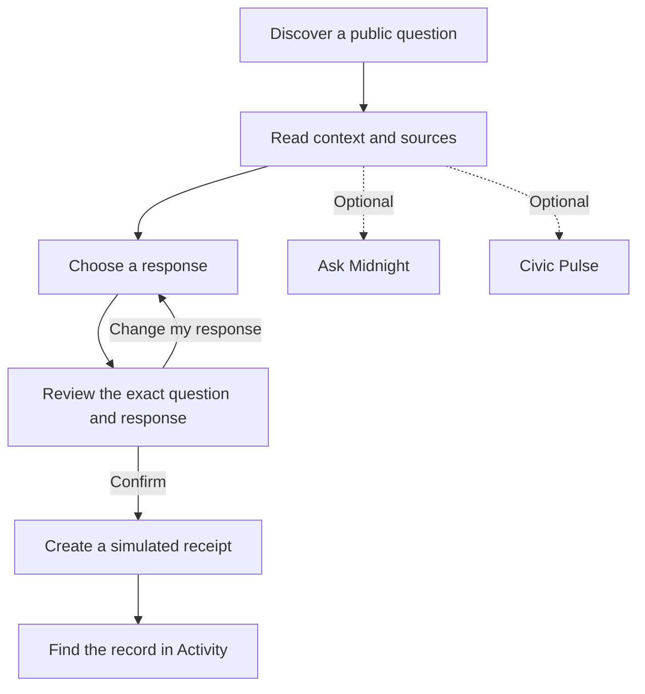
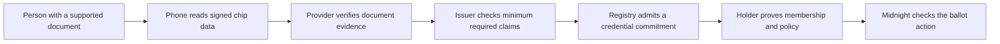
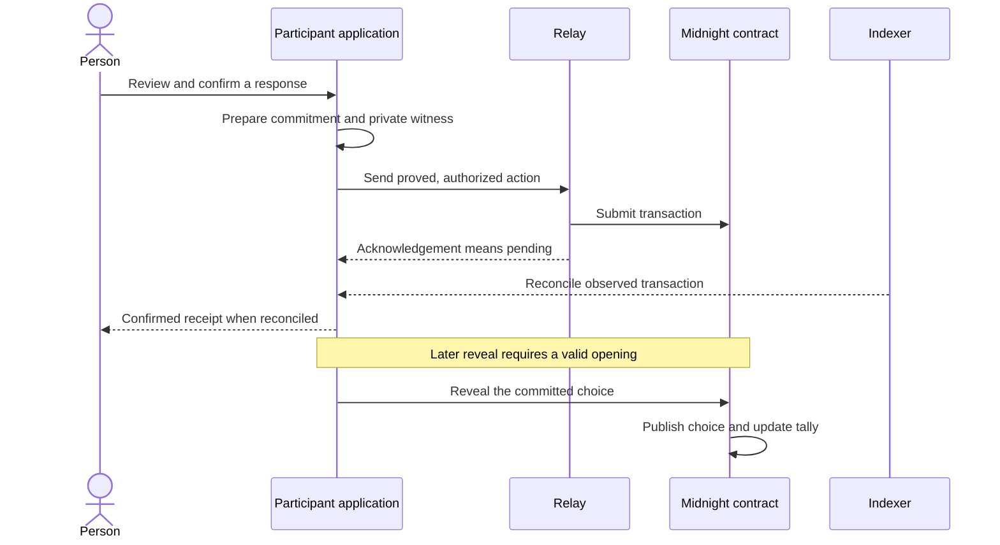

# How midnight.vote works

[Documentation home](README.md) · [Specification](specs/PRODUCT-SPEC.md) · [Architecture](ARCHITECTURE.md)

The product connects two questions: **“Do I understand this proposal?”** and **“Can I take part under its rules?”** Keeping those questions separate helps people make a deliberate choice without treating an account or document scan as permission to vote.

## Start with the person

Someone discovers a consultation, reads its context and checks its sources. Ask Midnight explains the catalogue using authored answers. Civic Pulse offers an optional space to think about priorities and tradeoffs. Neither feature casts a vote.

**Working demo:** eligibility is synthetic and the receipt is local. **Planned live journey:** an eligibility credential and confirmed network action replace those simulations. Missing live dependencies must produce a blocked or pending state, never an unlabelled simulated success.

## Account, document and permission

| Object | The question it answers | Example |
| --- | --- | --- |
| Passport session | How do I enter and choose what profile data to share? | A consented display name |
| Verified document evidence | What supported facts can a verifier establish? | Valid issuer signature and a defined age predicate |
| Eligibility credential | Does this holder satisfy this consultation's rule? | Citizenship and age meet the published policy |
| Vote authorization | Has the holder authorized this particular action? | A commitment to a response for this consultation |

A name or Passport session must not silently become a voter secret. A country filter must not become a nationality claim. Citizenship and residence are different: a residents' consultation needs evidence of residence, not an assumption from the passport's issuing country.

## The planned NFC-to-Midnight path

Near-field communication (NFC) lets a supported phone read signed data from a supported document's chip. The verification protocol, rather than the radio connection itself, checks the document and produces evidence.

A zero-knowledge (ZK) proof establishes a defined statement while keeping private inputs hidden. For example, it can support an age threshold without publishing a full date of birth. The policy and the fact that it passed can still reveal information.

**This is an integration design, not a completed device demonstration.** Provider verification and the Midnight transaction proof are different steps. Rarimo is replaceable behind the verification boundary; upstream guarantees do not automatically become guarantees of this application.

### Responsibilities and trust

| Role | Responsibility | Trust question |
| --- | --- | --- |
| Person | Consents, protects holder material and confirms the choice | Can they recover access safely? |
| Evidence provider | Validates supported document evidence | Which document types and checks are supported? |
| Issuer | Admits credentials under a defined policy | Can it issue duplicates or incorrect claims? |
| Root publisher | Makes an eligibility-set summary available to the referendum | Does the root match the intended registry? |
| Relay | Submits already-authorized work | Can retries or outages change the result? |
| Indexer | Exposes observed network state | Has the action actually appeared on chain? |

These questions become acceptance tests and operational procedures. Connecting two components does not resolve them by itself.

## From a response to a counted ballot

The implemented Compact design uses a commitment: a cryptographic value binding the response to this consultation and a private random salt. Later, a reveal opens that commitment and updates the public tally.

The sequence describes the intended live composition of implemented components. The demo creates a simulated receipt instead. Submission and indexer confirmation are different states.

## What stays private, and what becomes visible

| Stage | Intended private material | Public or observable information |
| --- | --- | --- |
| Document verification | Raw document data inside the restricted verification boundary | Minimum claims disclosed to the issuer under the policy |
| Credential proof | Holder secret, opening and membership witness | Accepted root and proof that the published policy passed |
| Commit | Choice and random salt | Commitment, event-scoped repeat-use marker and transaction metadata |
| Reveal | Identity is not explicitly attached by the circuit | **Choice**, commitment reference and running tally |
| Receipt | No choice stored in the local receipt record | Identifier, status and network reference |

Local proving includes the configured proof server in the private boundary. The [compatibility matrix](COMPATIBILITY-MATRIX.md) requires a loopback proof server because it sees witnesses. “Local” does not mean all computation happens inside the browser.

This implementation does **not** provide permanent secret ballots. Metadata, timing and small groups can also expose relationships. The [Compact review](COMPACT-REVIEW-2026-09-16.md) explains root-publisher trust, reveal deadlines and revocation limits.

## People and agents

People should know whether they are interacting with a credential-bearing person or a declared agent. Planned agent experiments use separate actor labels and results. They must not silently count as human participation.

A supported document can establish document facts under a protocol's assumptions. It does not alone prove liveness, global uniqueness or freedom from coercion. The contract's nullifier prevents the same bound secret being reused in the same consultation; duplicate documents and issuer behaviour need separate policy and verification.

## Read next

- [Glossary](GLOSSARY.md): source and review terminology.
- [Product specification](specs/PRODUCT-SPEC.md): acceptance requirements and tests.
- [Architecture](ARCHITECTURE.md): interfaces and service ownership.
- [Verification record](releases/2026-09-16-submission-candidate.md): results and their limits.
