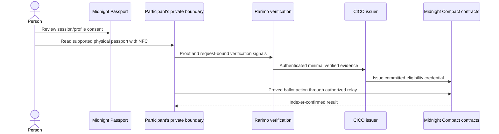

# Midnight Passport and the path from NFC to eligibility

[Documentation](README.md) · [Vision](VISION.md) · [Architecture](ARCHITECTURE.md)

## Passport is the starting point

Midnight Passport is the product's core entry point for consent and identity interaction. The intended experience gives people control over which claims they share. The current integration supplies a session and consented display-profile information; a session alone is not a civic credential or voting permission. The Passport product remains in its stagenet-beta phase; the dated network records in this repository describe their own environments.

| A consultation needs… | Intended proof or disclosure | Information it should not need |
| --- | --- | --- |
| Adults only | The age threshold is met, such as 18+ | Name or exact birth date |
| Citizens of a country | The required citizenship claim | Residential street address or full document |
| Local residents | Separate evidence of the relevant residence rule | An assumption that citizenship establishes residence |
| One use of a credential per consultation | A consultation-scoped nullifier | A public profile linked to every response |

These are design goals for minimal disclosure, not a statement that every row is available end to end today. Country can mean nationality, citizenship, residence or browsing preference; the application must state which it uses. The present document path derives citizenship.

## Intended verification journey

This is the intended composition. The public demo substitutes synthetic eligibility and local simulated receipts. A fresh physical NFC → evidence verification → issuance → commit → reveal → confirmed tally run is still required.

## Why NFC and zero-knowledge proofs

Reading the printed machine-readable zone (MRZ) helps start a document journey; photographing or parsing it does not authenticate a chip. NFC evidence and verification are separate steps. The first integration path uses Rarimo's ZK Passport approach to verify supported passport evidence and derive requested claims without sending the full document into the voting application.

The app's backend checks request bindings and verification results, then authorizes issuance. A returned callback, a scanned QR code or a connected Passport profile must not be treated as successful eligibility on its own. The [Rarimo architecture decision](adr/ADR-005-rarimo-evidence-boundary.md) describes the adapter and validation rules.

## What leaves the private boundary

| Boundary | Intended information crossing it | Important limit |
| --- | --- | --- |
| Passport → application | Consented session/display fields | Not voting authority |
| Evidence provider → issuer | Minimal verified claims and request authorization | The provider and issuer learn information required by this policy |
| Holder → proving process | Private witness material inside the configured private boundary | The local proof server sees witnesses; this is not a browser-only guarantee |
| Proved action → relay | Authorized proved transaction and runtime identifiers | Relay acknowledgement is not network confirmation |
| Contract → public observers | Commitments, roots, nullifiers, transaction metadata and revealed choices | Reveal makes the ballot choice public |

“You choose what leaves the device” is the desired consent model. Current evidence does not establish an entirely on-device physical-passport-to-ballot flow. Hosting a proof server remotely changes the privacy boundary and must be disclosed and reviewed.

## Verified document does not automatically mean unique human

The product goal is that counted human-lane votes come from real, eligible citizens. To establish this, the complete system must validate document evidence, bind issuance to the holder, handle duplicate documents and credential replacement, prevent replay and confirm the network result.

The existing referendum nullifier prevents repeat use of the same bound secret in the same consultation. It does not establish global person uniqueness, liveness, lack of coercion or uniqueness across issuers and replacement documents. These remain explicit acceptance requirements.

## Compact migration

Already in Compact: Credential Registry V1 and Referendum V2, including credential commitments, eligibility checks and ballot rules.

Future work: evaluate replacing the Rarimo evidence bridge with Compact-native passport verification or attestation. That requires a specified document trust model, supported cryptographic algorithms, issuer/root validation, proof costs, key and document revocation, test vectors, device performance measurements and independent review. A migration must preserve the provider-neutral credential interface and prove equivalent or stronger verification guarantees.

Start with [source ownership](ARCHITECTURE.md), [current contract limitations](COMPACT-REVIEW-2026-09-16.md), and the [live lifecycle acceptance checklist](NEXT-SPRINT-LIVE-LIFECYCLE.md).
