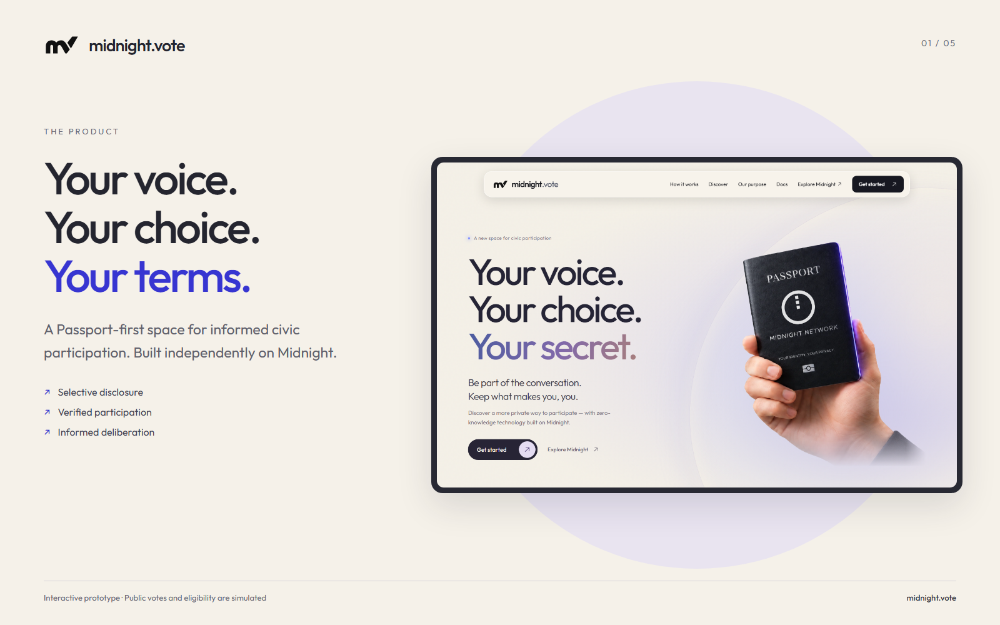
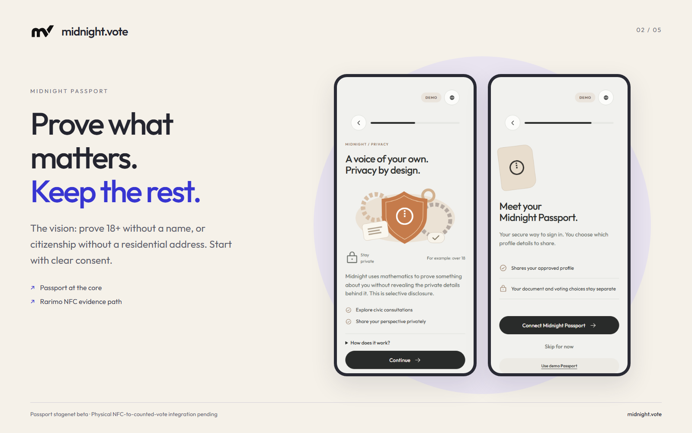
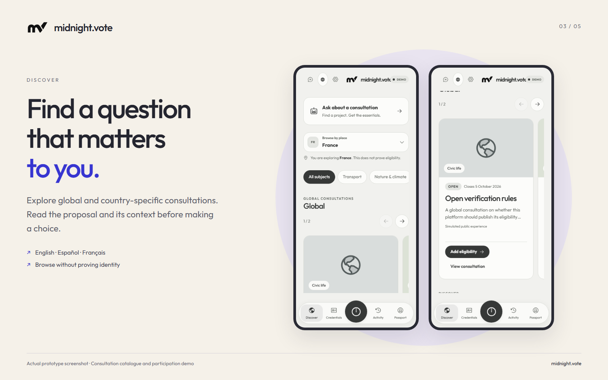
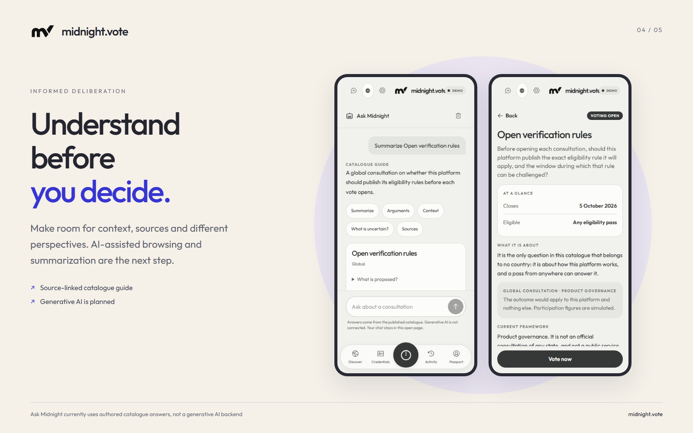
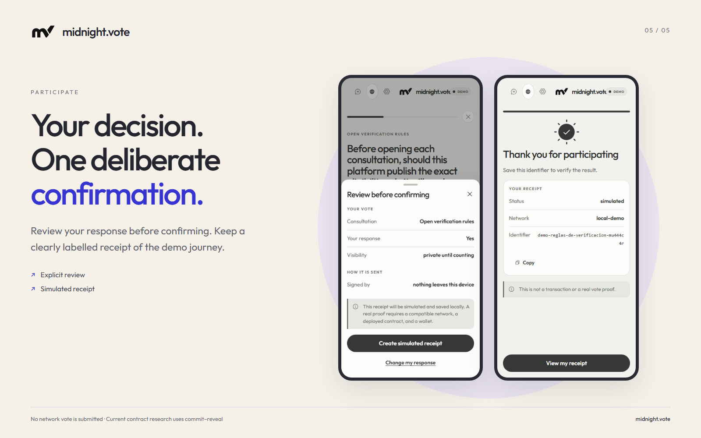

# midnight.vote — product submission

## Product name

midnight.vote

## Tagline

Understand more. Disclose less. Participate as yourself.

## Product type

**Prototype** — a working interactive demo with Compact contracts and integration services. The complete physical-passport-to-counted-network-vote journey is still being validated.

## Short description

midnight.vote is a Passport-first civic participation app built on Midnight. Our vision is simple: understand the issue, prove only what is needed, and make your own choice. Midnight Passport puts consent at the center; passport and NFC verification aim to establish eligibility without attaching identity documents to ballots. AI-assisted research and summaries are the next step toward making dense public questions easier to understand. Today, explore a multilingual demo with source-linked guidance, explicit simulated eligibility and receipts, backed by reviewable Compact contracts and integration code.

## What it does

**midnight.vote brings privacy and understanding into the same civic experience.**

Midnight Passport is at its core. The intended experience lets you prove a relevant fact — that you are 18+, for example, or a citizen of a particular country — without sharing your name, full date of birth or residential address. Privacy should be on your terms, with a clear choice about the information you disclose. Passport remains in its stagenet-beta phase; the current session/profile connection is separate from verified voting eligibility.

The human participation path we are building starts with a supported physical passport and NFC verification. The goal is to turn document evidence into a minimal eligibility attestation so that counted human-lane votes come from real, eligible citizens, while keeping identity evidence separate from the ballot. The first evidence path uses Rarimo ZK Passport technology. The credential registry and voting contracts already use Compact; bringing passport verification itself toward Compact is a future milestone.

Participation also requires understanding. We want people to browse reliable sources, make sense of dense proposals, compare arguments and understand one another. AI-assisted research and summarization are central to that product vision. Today's Ask Midnight provides authored catalogue explanations and source links; a generative browsing or summarization backend is not yet connected.

The public prototype supports English, Spanish and French. Visitors can discover consultations, read context, reflect on priorities, review a response and create a clearly labelled simulated receipt. Civic Pulse keeps drafts in memory by default and offers an explicit device-only save/delete option. It does not automatically upload reflections.

AI-agent participation in Midnight.city is an exploratory direction. Any future agent results will remain separate from verified-human totals.

## The problem it solves

People are asked to participate in decisions they may not have the time or context to understand. At the same time, checking participation rights often means collecting more personal information than a consultation needs.

midnight.vote addresses both barriers: make the question understandable, and establish the necessary eligibility without making a person's full identity part of their response. The starting point is non-binding community consultation, with a longer-term ambition to support informed, privacy-preserving deliberation.

## How we built it

We built a mobile-first React and TypeScript application around Passport consent, proposal discovery, source-linked context and deliberate review before confirmation. The demo keeps simulated credentials and receipts visibly labelled.

Underneath the interface, Compact contracts implement a credential registry and referendum rules, including eligibility checks, commitments, consultation-scoped nullifiers, reveal and tally. TypeScript interfaces separate Passport sessions, Rarimo evidence verification, credential issuance, authorized relaying and indexer-confirmed receipts. This separation allows the evidence provider to evolve without becoming the application's identity or voting authority.

The repository includes setup instructions, product specifications, architecture diagrams, dated test evidence and an explicit account of current limitations. The documentation is published at midnight.vote/docs and on GitHub.

## Challenges we ran into

The hardest challenge was keeping the product's promises aligned with the system's actual guarantees. Connecting Passport does not establish eligibility. Reading a document's printed information does not establish NFC authenticity. Submitting a transaction does not establish a confirmed vote.

We also had to make the privacy boundary precise. The current Compact referendum uses commit–reveal: a choice is hidden during commitment and becomes public at reveal. It is not permanently secret-ballot voting. A consultation-scoped nullifier prevents reuse of the same bound secret; it does not, by itself, guarantee one unique human across every document or issuer.

These boundaries shaped both the interface and the documentation. The prototype demonstrates the experience; a complete current-release physical-passport-to-network-tally run remains an integration milestone. Private proving is the goal, but the configured local proof server sees witnesses, so we do not claim an entirely browser-only or on-device end-to-end implementation today.

## What we learned

Privacy is a product decision at every boundary: what is requested, what is proved, what leaves the private environment, what becomes public and what a participant understands before confirming.

We also learned that better civic participation needs both trustworthy eligibility and understandable information. A proof cannot explain a proposal, and a helpful summary cannot establish a person's right to participate. The product needs both, with clear responsibilities and honest evidence.

## What's next

1. Complete and record the supported passport/NFC → verified evidence → eligibility credential → vote → confirmed tally lifecycle.
2. Resolve contract review findings and strengthen the privacy and recovery model before a live pilot.
3. Evaluate Compact-native passport verification, with documented trust assumptions, supported documents and device performance.
4. Introduce source-grounded AI research and summaries with citations, uncertainty handling and participant-controlled data sharing.
5. Explore Midnight.city agent participation in a separate experimental lane.

## Technologies

Midnight, Compact, TypeScript, React, Vite, Node.js, Rarimo ZK Passport integration, Web Crypto, Vitest, Playwright and Docker.

Suggested tags if limited to ten: Midnight, Compact, TypeScript, React, Zero-Knowledge Proofs, Digital Identity, Privacy, Civic Tech, Deliberation, Governance.

## Links

- Live prototype: https://midnight.vote
- Documentation: https://midnight.vote/docs
- GitHub: https://github.com/tomasgarro/midnight-vote
- Submission brief: https://github.com/tomasgarro/midnight-vote/blob/main/docs/SUBMISSION.md

## Image gallery — upload in this order

1. **Privacy on your own terms** — the independent midnight.vote identity and product introduction.
2. **Passport at the core** — the consent and selective-disclosure experience; beta/integration status remains explicit.
3. **Find a question that matters** — discover global and country-specific consultations.
4. **Understand before you decide** — source-linked catalogue guidance today, AI-assisted research as the vision.
5. **Review. Confirm. Keep a receipt.** — the simulated participation journey, with its demo label visible.

Use [product-icon.png](assets/submission/product-icon.png) for the product icon. Download the five gallery PNGs below. They show the actual prototype; captions distinguish present functionality from the future product vision.

## Submission note

This is paste-ready product copy, not confirmation of a portal submission. Supply your actual demo-video URL separately if the form requires one. Do not use an invented video, traction figure or claim of live verified voting.

## Gallery files

### privacy on your terms

### passport at the core

### discover questions

### understand before deciding

### review and receipt

