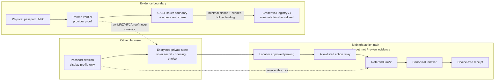
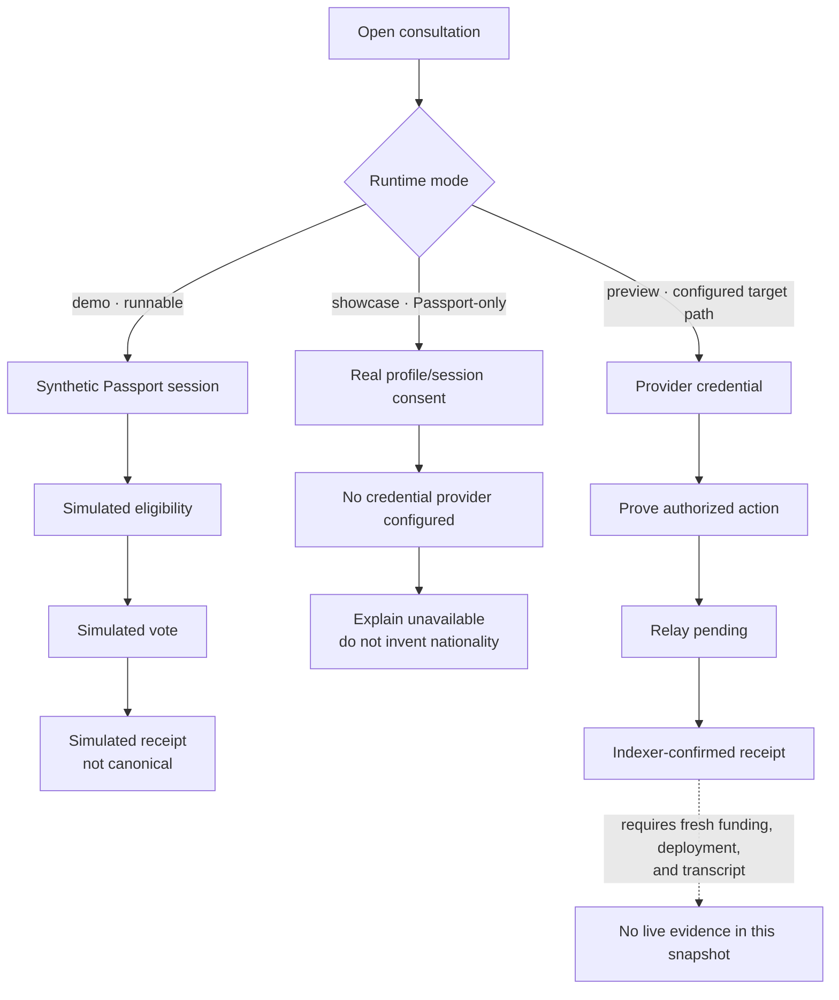
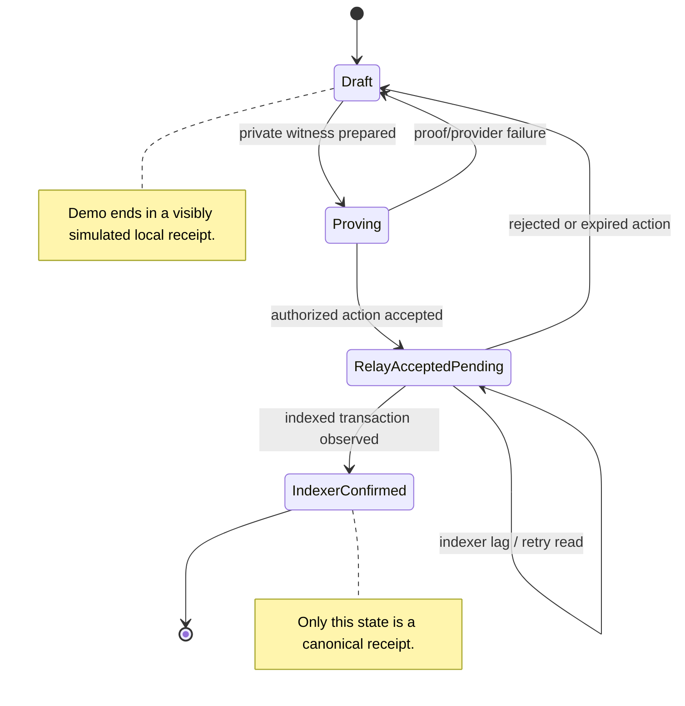

# Referéndum Cívico — jury submission brief

**Snapshot:** 1 September 2026 · **Product:** a non-binding civic
consultation prototype for Midnight

This page is the shortest honest route through the repository for a jury. It
describes what can be demonstrated from source, what is independently
observed, and what remains a target. It is not a release approval, an official
election, a human-uniqueness claim, or a Midnight Preview deployment record.

## The idea in one minute

People should be able to understand and answer a civic consultation without
publishing a profile, document, ballot choice, or voter secret. Referéndum
Cívico makes that boundary visible:

1. a person explores a consultation in plain language;
2. Passport can provide consented profile/session display data;
3. a separate evidence provider can eventually attest minimal eligibility;
4. the browser keeps the voter secret, credential opening, witness, and choice
   private;
5. a live Midnight action would be relayed only after authorization and would
   become a canonical receipt only after indexer confirmation.

The current demo exercises this story with synthetic eligibility, a simulated
vote, and a visibly simulated receipt. It does not turn a fixture into a real
credential or transaction.

## What a juror can run today

Use Node 22 and npm 10 from the repository root:

```bash
npm ci
VITE_APP_MODE=demo npm run dev -- --host localhost --port 4173 --strictPort
```

On Windows PowerShell:

```powershell
npm ci
$env:VITE_APP_MODE='demo'
npm run dev -- --host localhost --port 4173 --strictPort
```

Open `http://localhost:4173`. A short path through the product is:

`Get started` → privacy explanation → `Use demo Passport` → `Continue` →
choose a country → `Create my simulated pass` / `Crear mi pase simulado` →
`See the consultations` → `Read proposal` → `Vote now` → choose an answer →
`Review` → create the simulated receipt.

The simulated badge/disclosure is part of the product contract. A simulated
receipt is local demonstration state, not a canonical chain receipt.

The current synthetic jury demo is live at
[`lightskyblue-emu-103266.hostingersite.com`](https://lightskyblue-emu-103266.hostingersite.com/).
The deployed archive was privacy-scanned, its 79 files match the reviewed
`ui/dist`, and its SHA-256 is
`99FC4EAE91F4B6E8249D5EDEED6FBDC5936651B31CD7026B01D6DF231DE35529`.
HTTPS rendering, SPA fallback, and 320/390/tablet/desktop first interactions
were externally verified on 1 September 2026 without browser errors or
horizontal overflow. This is current **synthetic UI**
evidence; it is not a claim of a Preview contract deployment, real NFC proof,
Rarimo verification, or canonical on-chain receipt.

## Evidence matrix

| Surface | What is evidenced | What is not evidenced |
| --- | --- | --- |
| Synthetic journey | Local demo path, source tests, and explicit simulated labels | A real credential, real vote, or canonical receipt |
| Passport profile/session | A human-observed live handshake returning only the requested profile field; see [`evidence/passport-live/2026-08-31-first-real-session.md`](evidence/passport-live/2026-08-31-first-real-session.md) | Passport credential, wallet, recovery, holder binding, Preview address, or Passport-to-contract authority |
| Contract policy and ports | Checked-in Compact contracts, provider-neutral ports, simulator/unit coverage, and a historical local lifecycle | A current Preview deployment, funded action, or current release manifest |
| Rarimo/NFC | Temporary adapter boundary, minimal-claim design, and source/conformance tests | Hosted verifier, authenticated callback, real proof, or a physical NFC/ePassport run |
| Historical Undeployed v2 | Exact source SHA, tree, manifest digest, and preserved local transcript at [`evidence/undeployed-v2/abdd0a2/`](evidence/undeployed-v2/abdd0a2/) | Evidence for this checkout, Preview, Passport approval, or NFC |
| Document journey | Real camera access with per-cause recovery, check-digit-verified TD3 parsing tested against the ICAO specimen, EN/FR/ES copy, and an explicit RariMe handoff where the browser cannot proceed | A physical ePassport chip read in this browser, an NFC-backed credential issued end to end, or a recorded walkthrough video |
| Static public artifact | Current Hostinger synthetic demo, exact archive SHA, privacy scan, 79-file build match, HTTPS render, SPA fallback, 320/390/tablet/desktop first interactions, and green release CI | Response-header hardening and re-verification before public-release certification |

## The document journey, and where the browser stops

Verify is the app's one global action. Pressing it opens a nine-screen journey
modelled on Référendum Citoyen — the French civic-voting app built on the same
Rarimo passport attestation this product uses — in English, French, and
Spanish.

| Screen | What it does | Real or explained |
| --- | --- | --- |
| 1-3 · Voting process | Teaches unique-vote, local verification, anonymous credential, and states that identity is not retained | Explanation |
| 4 · Walkthrough | Skippable provider walkthrough | Existing `passport-scan` clip with localized captions; editing deferred |
| 5 · Start analysis | Sets expectations: physical passport, about two minutes | Explanation |
| 6 · Camera permission | Explains why before the browser prompt; distinct recovery for denied, insecure-context, no-device, in-use, unsupported | **Real** |
| 7 · Photo page | Live rear camera, passport-page-ratio frame, MRZ guide, and check-digit-verified TD3 parsing; manual document number / birth date / expiry as the guaranteed fallback | **Real** |
| 8-9 · Chip read | Hold the passport to the phone, read in progress | **Handoff to RariMe** |

**The browser cannot read a passport chip.** The chip speaks ISO 14443 APDUs
and no web API exposes them; Web NFC does not perform ePassport reads. The
reference app is a native Android build and does it itself. Rather than
animate a progress bar that measures nothing, screens 8-9 keep the reference's
instruction and hand off to RariMe, where the read genuinely happens. No
simulated chip read ships.

What is genuinely ours, and testable from source:

- `ui/src/integration/mrz.ts` — TD3 parser verifying all four ICAO 9303 check
  digits, including the composite digit that catches a two-frame OCR splice.
  Tested against the published Doc 9303 specimen rather than a self-generated
  fixture, so a wrong implementation could not agree with its own tests.
- `ui/src/integration/camera.ts` — secure-context, permission, device, and
  in-use guards, each with its own recovery.
- `ui/src/integration/mrz-recognition.ts` — native `TextDetector` where the
  platform has it. A WASM OCR engine is ruled out rather than attempted: the
  deployed CSP is `script-src 'self'` with no `wasm-unsafe-eval`, so it would
  be blocked on the very origin a juror opens.
- Reduction happens before anything leaves the screen: the parsed record
  becomes country plus adult status, and the birth date is never carried
  forward.

Manual entry is offered as the weaker read and says so: a typed document
number carries no check digit to verify, and no nationality, so the chip
remains the authority in either case.

**Where the journey is wired.** It fronts the demo and showcase modes, which
is what a juror opens. Preview and undeployed keep their existing enrolment
screen, which already performs the real RariMe handoff and polls the real
enrolment status. Bringing the nine screens in front of that path is the next
step and is deliberately not done here: it cannot be exercised until the CICO
service is hosted, and shipping untested code on the one path that talks to a
real issuer is the wrong trade.

## Privacy and trust boundaries

The core product argument is a separation of authorities. Passport is a
consent/session surface; document evidence is temporary and issuer-bound; the
browser protects private voting material; and an indexer, not a relay response,
defines a confirmed receipt.



The diagram is an architecture target, not a claim that the right-hand path
is deployed on Preview. In the demo, the synthetic adapter and simulated
receipt are deliberately substituted and labelled.

## One journey, three modes

This is the product's honest mode contract. Only the demo path is runnable
without external funding or approvals in this checkout.



`showcase` and `preview` are capability modes, not proof by themselves. A
configured mode must fail closed when its provider, network, manifest, or
funding is absent.

## Receipt lifecycle

The user-facing receipt is intentionally separated from an acknowledgement
from the relay. The canonical state is reached only when the indexer confirms
the transaction.



## What is not claimed

- No Midnight Preview registry, referendum, credential, vote, or receipt is
  deployed or evidenced in this snapshot.
- No physical NFC or ePassport APDU read has been observed on hardware, and
  none is possible in this browser. Screens 8-9 of the document journey are a
  handoff to RariMe, not a chip read.
- A camera MRZ read is not an NFC-backed credential. Reading the printed page
  proves the page was presented; only the chip proves the document is genuine.
  Manual entry is weaker still and is labelled as such in the interface.
- No hosted Rarimo verifier, authenticated callback, real proof, or deletion
  and replay run is evidenced.
- No Passport credential, Preview address, wallet, recovery, biometric,
  `.night` ownership, or Passport-to-contract authority is claimed.
- The current Hostinger artifact is synthetic UI evidence, not Preview,
  credential, NFC, Rarimo, or canonical-receipt evidence.
- Synthetic state is not proof of document authenticity, citizenship, adult
  status, human uniqueness, or anti-coercion.

## Evidence checklist before submission

The release owner should attach every item below to one exact source SHA. Do
not record secrets, raw provider payloads, document images, voter material, or
ballot choices.

- [ ] Release commit SHA, source tree, build command, artifact digest, and
      reviewer/date are recorded together.
- [ ] `npm ci`, production build, formatting/lint, unit/simulator tests, and
      targeted Chromium journey tests pass from the same checkout.
- [x] The static artifact has an exact SHA, passed its privacy scan, matches all
      79 reviewed `ui/dist` files, and passed HTTPS home, SPA fallback, and
      320/390/tablet/desktop first-action smoke checks without browser errors or
      horizontal overflow.
- [ ] Response headers are hardened and externally rechecked before
      public-release certification. The host currently supplies only
      `Content-Security-Policy: upgrade-insecure-requests`.
- [ ] English and Spanish screenshots show the synthetic truth labels and the
      corrected `Create my simulated pass` / `Crear mi pase simulado` CTA.
- [ ] Browser storage, bundle, logs, and requests contain no raw MRZ/NFC,
      provider proof, voter secret, opening, witness, choice, or service secret.
- [ ] The real Passport session transcript is linked separately and scoped to
      profile/session only; it is not upgraded into credential evidence.
- [ ] Contract, conformance, idempotency, replay, and receipt-reconciliation
      tests are linked with their observed counts from the release run.
- [ ] Any live Preview claim has a fresh manifest/transcript for that SHA,
      funded NIGHT/DUST roles, contract addresses, action receipt, and indexer
      reconciliation.
- [ ] Any real NFC claim has a pinned verifier, authenticated callback,
      physical-device transcript, minimal-claim issuance, deletion/retention,
      and replay evidence.

## Priority for the remaining submission window

1. Keep the now-green release CI and current hosted synthetic artifact intact.
2. Spend remaining engineering time only on the first real Preview vertical
   slice: fully synced positive DUST, exact deployment inputs, contracts,
   credential issuance, one vote, and indexer reconciliation.
3. Keep Preview and NFC claims visibly separate from the synthetic jury demo.
4. If external DUST, verifier, Passport, or hardware evidence arrives,
   add it as a new exact-SHA evidence record. Never relabel the historical
   `abdd0a2` transcript.

## Deep links

- [Current release readiness](CURRENT-RELEASE-READINESS.md)
- [Preview and backend readiness](PREVIEW-AND-BACKEND-READINESS.md)
- [Architecture map](ARCHITECTURE.md)
- [User-action matrix](USER-ACTION-MATRIX.md)
- [Wave 1 evidence checklist](WAVE-1-SUBMISSION-CHECKLIST.md)
- [Documentation index](README.md)
