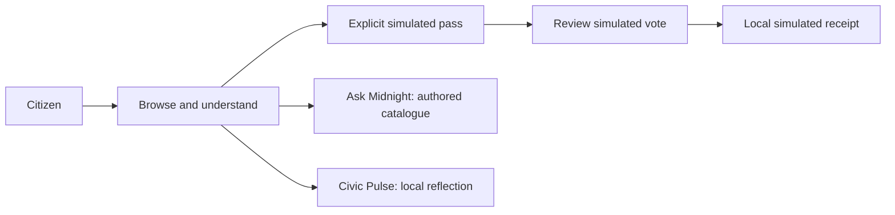
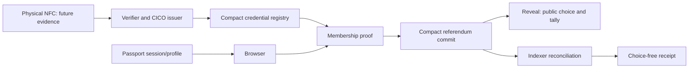

# midnight.vote — submission brief

**16 September 2026 · Final project documentation**

[Live demo](https://midnight.vote) · [Public Docs](https://midnight.vote/docs) · [Source](https://github.com/tomasgarro/midnight-vote) · [Release evidence](releases/2026-09-16-final-documentation.md)

Application baseline: merged PR #35, source revision 8184f70. This submission packages the current product demonstration, source, architecture and evidence. It does not claim completion of a hackathon portal submission or enable live network voting.

## Project summary

**midnight.vote helps people understand more, disclose less and participate as themselves.** Midnight Passport is the core of the experience: the intended selective-disclosure model lets someone prove an age threshold without their name, or citizenship without their residential address. Passport remains in its stagenet-beta phase; current session/profile integration is distinct from eligibility proof.

The intended human participation path starts with a real passport and NFC verification, produces minimal eligibility evidence, and uses private proving and Midnight contracts to enforce participation rules. The first evidence path uses Rarimo ZK Passport technology; moving passport verification toward Compact is future work. The credential registry and ballot contracts already use Compact.

Informed participation also requires understanding dense public material. The product vision includes AI browsing, summarization and comparison of perspectives. Today's Ask Midnight is an authored catalogue guide, not a generative backend. AI-agent voting in Midnight.city remains exploratory and must stay separate from verified-human totals.

The delivered contribution combines a multilingual mobile demo with Compact contracts and provider-neutral TypeScript interfaces for issuance, authorization, relaying and receipt reconciliation. The public vote is simulated. A current-release physical-passport-to-confirmed-network-vote journey is still pending.

Read the [vision](VISION.md), [Passport and proof chapter](PASSPORT-AND-PROOFS.md), and [deliberation roadmap](AI-AND-DELIBERATION.md) for the complete product rationale.

## Problem and intended users

Community members need understandable proposals and clear participation rules. Organizers need an eligibility mechanism without collecting identity alongside each ballot. Reviewers need to distinguish an attractive interface from verified infrastructure.

The first intended use is an invited, non-binding community consultation. Official elections, coercion resistance, universal human uniqueness, and production identity assurance are outside this submission.

## What is submitted

| Component | Delivered in source | Demonstrated or verified boundary |
| --- | --- | --- |
| Civic experience | Optional onboarding; global/country discovery; proposal details; English, Spanish and French; settings and activity | Demo UI; device and browser checks are scoped to their recorded runs |
| Simulated participation | Explicit test country/age, eligibility restrictions, answer review, local simulated receipt | No network vote, document verification, or canonical receipt |
| Ask Midnight | Contextual catalogue responses, follow-ups, uncertainty and source links | Authored deterministic retrieval; no generative AI backend |
| Civic Pulse | Optional guided reflection, review/edit/skip, budget tradeoffs | Drafts in memory; optional explicit local save/review/delete and user-controlled AI prompt export; no automatic submission or population statistics |
| Compact | Credential Registry V1, Referendum V2, and legacy referendum source/tests | CI compiled all three; legacy 3 and V2 28 simulator tests passed in the cited run |
| Integration services | API/domain ports, CICO issuer adapter, sponsored relayer, canonical receipt checks | Unit/conformance evidence; not a completed current-release physical-passport journey |
| Passport | Session/profile bridge | Historical real session evidence only; connection does not establish voting eligibility |
| NFC/Rarimo | Document journey, provider handoff and verifier/issuer boundaries | Physical NFC-to-Midnight participant lifecycle not evidenced |

See the [product specification](specs/PRODUCT-SPEC.md) for requirements and traceability and the [Compact review](COMPACT-REVIEW-2026-09-16.md) for technical limitations.

## Three-minute demonstration

1. Open the demo and explain: “This is a non-binding consultation prototype; this run uses simulated eligibility and receipts.”
2. Browse consultations; open a proposal and its supporting context.
3. Choose the explicit simulated Passport/pass path, a test country, and an adult test age.
4. Select an eligible consultation, choose an answer, review it, and create the simulated receipt.
5. Show the simulated label and Activity. The receipt is not a transaction.
6. Open Ask Midnight, ask about a catalogue topic, and show sources and the authored-answer disclosure.
7. Optionally open Civic Pulse, edit or skip an answer, and finish. Explain the default in-memory draft, optional device-only save/delete, and disclosure involved in copying answers to an external AI service.

Follow the [quick start](QUICKSTART.md) to build the demo from a clean checkout. It includes the pinned compiler prerequisite, explicit demo mode and the expected walkthrough. Use the chosen release artifact rather than an unverified public URL. Historical hosting evidence retains its [recorded scope](releases/2026-09-13-current-state.md).

## How the pieces connect

The intended live architecture is separate:

Passport profile data does not authorize the ballot. The diagram describes service roles and intended integration, not a live deployment claim.

## Privacy: precise claims

The current Compact implementation protects credential openings, voter secret, and ballot choice during commit. A referendum-specific nullifier prevents reuse of the same bound secret in that referendum; it does not prove one unique human across all documents or issuers.

**Reveal publishes the choice and updates a public tally.** Commitments, roots, nullifiers, transaction timing and state changes also create observable metadata. A choice-free receipt does not make the underlying reveal private. Small groups and timing correlation can weaken anonymity. This is a commit–reveal prototype, not an audited permanently secret-ballot system.

The issuer and accepted-root process are trust boundaries. Root revocation does not revoke an individual credential in an append-only tree. The [technical review](COMPACT-REVIEW-2026-09-16.md) records further limits, including reveal deadline behavior.

The demo establishes none of document authenticity, citizenship, uniqueness, or real eligibility. Camera/MRZ parsing and a Passport connection do not establish NFC proof.

## Evidence and release status

Start with the [final documentation release record](releases/2026-09-16-final-documentation.md). The records below are historical and retain their original source and scope.

The merged application baseline has successful [test CI](https://github.com/tomasgarro/midnight-vote/actions/runs/35095816561) and [format/lint CI](https://github.com/tomasgarro/midnight-vote/actions/runs/35095816534). The documentation release has its own local build, UI, browser and privacy checks in the release record.

Historical [Preview evidence](evidence/preview-2026-09-02/README.md), [local lifecycle evidence](evidence/undeployed-v2/abdd0a2/), and [Passport session evidence](evidence/passport-live/2026-08-31-first-real-session.md) retain their original dates and scope. They do not establish a new live voting deployment. Earlier CI incidents and mobile fixes remain in the dated release records.

## Next milestones

1. Freeze and package this demo with one source revision, build digest, walkthrough, and test record.
2. Resolve contract review findings, then record a fresh issue → commit → reveal → finalize lifecycle with indexer-confirmed receipts.
3. Connect physical NFC through authenticated provider verification, minimal claims, replay protection and retention checks.
4. Evaluate a source-grounded AI assistant separately, with citations, abstention, privacy controls and a benchmark.

The [submission plan](SUBMISSION-PLAN.md) defines the scope cutoff and future acceptance gates.
