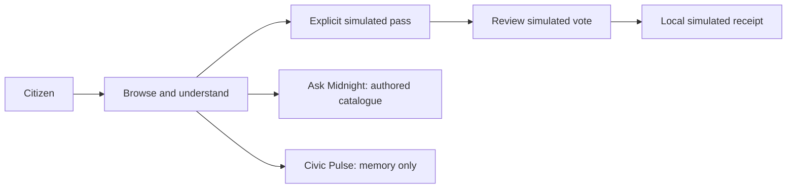
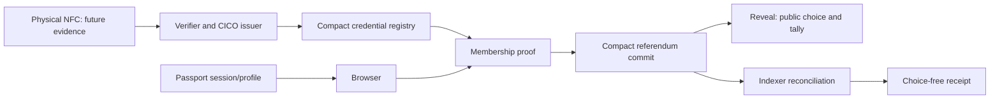

# midnight.vote — submission brief

**16 September 2026 · Demonstration release candidate**
Deployed application source: merged `main` at `43535872f9d1c48cc8380451bb95b7d35d9b2900` (PRs #31 and #32). Try the explicit demo at [midnight.vote](https://midnight.vote). [PR #33](https://github.com/tomasgarro/midnight-referendum-app/pull/33) contains test corrections and mobile coverage; the [mobile release record](releases/2026-09-16-mobile-release.md) identifies the artifact and hosted verification. Live network voting remains outside this demo.

## Project summary

midnight.vote is a multilingual prototype for informed, non-binding civic participation. People can explore global and country-specific consultations, read authored context and sources, reflect privately on priorities, and complete a clearly labelled simulated voting journey. The interface separates a Midnight Passport account, a physical identity document, and an eligibility credential.

The technical contribution is a Compact credential registry and referendum design, with provider-neutral TypeScript adapters for issuance, authorization, relaying, and receipt reconciliation. The submission combines a working product demonstration with compiled and tested contract source. The demonstrated vote is simulated; a current-source, passport-backed end-to-end network vote remains future work.

## Problem and intended users

Community members need understandable proposals and clear participation rules. Organizers need an eligibility mechanism without collecting identity alongside each ballot. Reviewers need to distinguish an attractive interface from verified infrastructure.

The first intended use is an invited, non-binding community consultation. Official elections, coercion resistance, universal human uniqueness, and production identity assurance are outside this submission.

## What is submitted

| Component | Delivered in source | Demonstrated or verified boundary |
| --- | --- | --- |
| Civic experience | Optional onboarding; global/country discovery; proposal details; English, Spanish and French; settings and activity | Demo UI; device and browser checks are scoped to their recorded runs |
| Simulated participation | Explicit test country/age, eligibility restrictions, answer review, local simulated receipt | No network vote, document verification, or canonical receipt |
| Ask Midnight | Contextual catalogue responses, follow-ups, uncertainty and source links | Authored deterministic retrieval; no generative AI backend |
| Civic Pulse | Optional guided reflection, review/edit/skip, budget tradeoffs | Answers remain in component memory; no submission or population statistics |
| Compact | Credential Registry V1, Referendum V2, and legacy referendum source/tests | CI compiled all three; legacy 3 and V2 28 simulator tests passed in the cited run |
| Integration services | API/domain ports, CICO issuer adapter, sponsored relayer, canonical receipt checks | Unit/conformance evidence; not a completed current-release physical-passport journey |
| Passport | Session/profile bridge | Historical real session evidence only; connection does not establish voting eligibility |
| NFC/Rarimo | Document journey, provider handoff and verifier/issuer boundaries | Physical NFC-to-Midnight participant lifecycle not evidenced |

See the [product specification](specs/PRODUCT-SPEC.md) for requirements and traceability and the [Compact review](COMPACT-REVIEW-2026-09-16.md) for technical limitations.

## Three-minute demonstration

1. Open the demo and explain: “This is a non-binding consultation prototype; this run uses simulated eligibility and receipts.”
2. Browse consultations; open a proposal and its supporting context.
3. Choose the explicit simulated Passport/pass path, a test country, and an adult test age.
4. Select an eligible consultation, choose an answer, review it, and create the simulated receipt.
5. Show the simulated label and Activity. The receipt is not a transaction.
6. Open Ask Midnight, ask about a catalogue topic, and show sources and the authored-answer disclosure.
7. Optionally open Civic Pulse, edit or skip an answer, and finish. Explain that answers stay in memory.

Follow the [quick start](QUICKSTART.md) to build the demo from a clean checkout. It includes the pinned compiler prerequisite, explicit demo mode and the expected walkthrough. Use the chosen release artifact rather than an unverified public URL. Historical hosting evidence retains its [recorded scope](releases/2026-09-13-current-state.md).

## How the pieces connect

The intended live architecture is separate:

Passport profile data does not authorize the ballot. The diagram describes service roles and intended integration, not a live deployment claim.

## Privacy: precise claims

The current Compact implementation protects credential openings, voter secret, and ballot choice during commit. A referendum-specific nullifier prevents reuse of the same bound secret in that referendum; it does not prove one unique human across all documents or issuers.

**Reveal publishes the choice and updates a public tally.** Commitments, roots, nullifiers, transaction timing and state changes also create observable metadata. A choice-free receipt does not make the underlying reveal private. Small groups and timing correlation can weaken anonymity. This is a commit–reveal prototype, not an audited permanently secret-ballot system.

The issuer and accepted-root process are trust boundaries. Root revocation does not revoke an individual credential in an append-only tree. The [technical review](COMPACT-REVIEW-2026-09-16.md) records further limits, including reveal deadline behavior.

The demo establishes none of document authenticity, citizenship, uniqueness, or real eligibility. Camera/MRZ parsing and a Passport connection do not establish NFC proof.

## Evidence and release status

The supplied [CI job](https://github.com/tomasgarro/midnight-referendum-app/actions/runs/35068664679/job/104704743304) compiled the contracts and passed the contract/API/CICO/relayer checks. Its UI stage had 251 passing tests and one asynchronous receipt assertion failure; the dependent browser job was skipped. That run must not be described as green.

The [mobile release record](releases/2026-09-16-mobile-release.md) records the corrected tests, 252 passing local UI tests, artifact verification and four passing Android/iPhone journeys against the public demo. Historical [Preview evidence](evidence/preview-2026-09-02/README.md), [local lifecycle evidence](evidence/undeployed-v2/abdd0a2/), and [Passport session evidence](evidence/passport-live/2026-08-31-first-real-session.md) retain their original dates and scope. They are not evidence for a new live voting deployment.

## Next milestones

1. Freeze and package this demo with one source revision, build digest, walkthrough, and test record.
2. Resolve contract review findings, then record a fresh issue → commit → reveal → finalize lifecycle with indexer-confirmed receipts.
3. Connect physical NFC through authenticated provider verification, minimal claims, replay protection and retention checks.
4. Evaluate a source-grounded AI assistant separately, with citations, abstention, privacy controls and a benchmark.

The [submission plan](SUBMISSION-PLAN.md) defines the scope cutoff and future acceptance gates.
