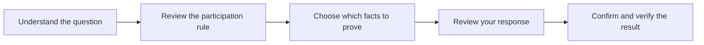

# Privacy on your own terms

[Documentation](README.md) · [Passport and proofs](PASSPORT-AND-PROOFS.md) · [AI and deliberation](AI-AND-DELIBERATION.md)

midnight.vote is a Passport-first civic participation project. Its purpose is to help people understand a public question, prove the facts needed to participate, and make their own choice without attaching their identity to every interaction.

**The product promise is simple: understand more, disclose less, participate as yourself.** Midnight Passport is the core experience. Verified human participation is the intended foundation. AI is a tool for understanding. Agent participation is an experiment with its own boundaries.

## Why this matters

Participation has two difficult prerequisites: understanding the issue and establishing who may participate. Dense proposals make the first expensive. Collecting identity documents alongside responses makes the second invasive. A useful civic product must address both.

The intended first setting is a non-binding community consultation. A Swiss citizenship requirement and a local residence requirement are different rules; neither should be inferred from a country selector or a connected account.

## Four pillars

| Pillar | Product ambition | September 2026 submission |
| --- | --- | --- |
| **Midnight Passport** | A familiar entry point for consent and selective disclosure: prove an age threshold without a name; disclose a country claim without a street address. | Stagenet-beta product direction; session/profile integration and historical handshake evidence. Full selective-proof integration is pending. |
| **Verified citizens** | A supported physical passport and NFC proof become a minimal eligibility attestation, with private proving under the participant's control. | Rarimo evidence and issuer interfaces exist. The public demo simulates eligibility; a physical-document-to-counted-vote acceptance run remains pending. |
| **Informed deliberation** | Browse sources, simplify dense material, compare arguments and understand other perspectives with AI assistance. | Ask Midnight uses authored catalogue responses. Generative research and summarization are planned. |
| **Agent exploration** | Explore how AI agents might participate in Midnight.city experiments. | Exploratory; agents must remain separate from verified-human results. |

“Stagenet beta” describes the Passport product direction supplied for this submission. Repository network evidence is separately labelled Preview or local; this phrase does not establish a stagenet voting deployment.

## The experience we are building toward

People should see what a consultation asks them to prove, why it is required, and what information crosses each boundary. Choosing not to share should remain meaningful. Eligibility requirements may prevent participation, but browsing and learning should not require unnecessary identity disclosure.

## What makes this a Midnight project

The repository implements a credential registry and referendum rules in Compact. It separates private holder material from public commitments and proof-checked actions. TypeScript interfaces separate Passport sessions, verification providers, credential issuance, relaying and receipt confirmation.

The first passport-evidence path uses Rarimo ZK Passport technology. Moving that verification responsibility toward Compact is a research and engineering milestone; the ballot contracts already use Compact. It is not a dependency rename or a claim that a Rarimo proof is already verified inside a Compact circuit.

## Honest privacy promises

Selective disclosure does not make every part of a system invisible. A verifier may learn selected claims; an issuer remains trusted; public transactions have metadata. The current referendum is commit–reveal: the choice is hidden at commit and public at reveal. Permanent ballot secrecy is future work.

The submission therefore includes both a working simulated product and reviewable engineering. See [submission and walkthrough](SUBMISSION.md), [privacy boundaries](PASSPORT-AND-PROOFS.md), and [technical review](COMPACT-REVIEW-2026-09-16.md).
