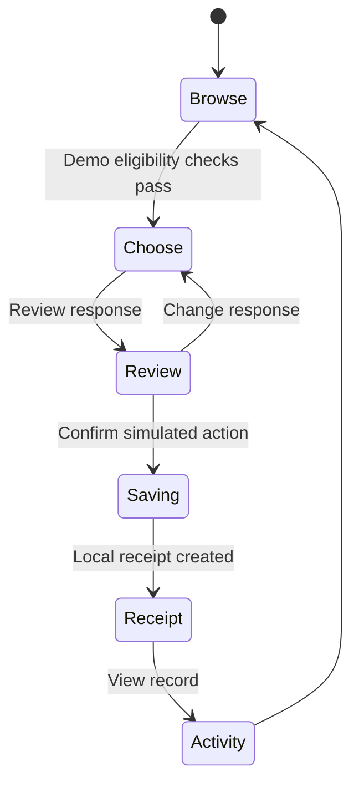

# Product specification — midnight.vote

Version 0.2 · 16 September 2026 · Application baseline: merged PR #35, `8184f70`. Includes PR #34 explicit local-reflection consent and the PR #36 documentation route.
Status: specification extracted from implemented behavior, with future requirements explicitly marked. It is a baseline for future spec-first changes, not a claim that earlier code was developed from this document.

## Purpose and scope

Enable a person to understand a non-binding civic consultation, distinguish account access from eligibility, and complete an honest demonstration of participation. Today’s release unit is the demo frontend plus reviewable Compact and service source.

Roles: participant (browse/reflect/participate), organizer (policy/schedule), issuer (credential admission), root publisher (accepted roots), relay operator (authorized submission), and reviewer (evidence). These roles must not silently inherit each other's authority.

Non-goals: binding elections; audited ballot secrecy; physical NFC completion in this release; production-scale operation; representative polling; biometric uniqueness; LLM persuasion or inferred political profiles.

## Requirements and implementation traceability

“MUST” is the acceptance requirement. Source/tests listed below are traceability, not an assertion that every release run passed.

| ID | Requirement | Implementation / verification | Status |
| --- | --- | --- | --- |
| UX-01 | A person MUST be able to defer onboarding without gaining eligibility. | [ui/src/CivicRuntime.tsx](../../ui/src/CivicRuntime.tsx); [ui/src/__tests__/App.test.tsx](../../ui/src/__tests__/App.test.tsx); [tests/e2e/onboarding-v3.spec.ts](../../tests/e2e/onboarding-v3.spec.ts) | Implemented demo |
| UX-02 | Country browsing MUST NOT create a credential or voting authorization. | [ui/src/__tests__/App.test.tsx](../../ui/src/__tests__/App.test.tsx); [ui/src/__tests__/votes-view.test.tsx](../../ui/src/__tests__/votes-view.test.tsx) | Implemented |
| DEMO-01 | A simulated pass and receipt MUST remain explicitly simulated. | [ui/src/views/VoteFlow.tsx](../../ui/src/views/VoteFlow.tsx); [ui/src/__tests__/App.test.tsx](../../ui/src/__tests__/App.test.tsx); [tests/e2e/passport-journey.spec.ts](../../tests/e2e/passport-journey.spec.ts) | Implemented |
| DEMO-02 | Participation MUST apply age, expiry, country and consultation availability checks. | [ui/src/CivicRuntime.tsx](../../ui/src/CivicRuntime.tsx); [tests/e2e/discovery-demo.spec.ts](../../tests/e2e/discovery-demo.spec.ts) | Implemented; simulation only |
| RECEIPT-01 | UI completion MUST follow asynchronous receipt creation; Activity MUST retain distinct receipts. | [ui/src/integration/receipt-store.ts](../../ui/src/integration/receipt-store.ts); [ui/src/__tests__/App.test.tsx](../../ui/src/__tests__/App.test.tsx); [ui/src/__tests__/receipt-store.test.ts](../../ui/src/__tests__/receipt-store.test.ts) | Implemented; asynchronous correction merged |
| AI-01 | Ask Midnight MUST identify authored catalogue responses and keep unsupported requests bounded. | [ui/src/__tests__/catalogue-guide.test.tsx](../../ui/src/__tests__/catalogue-guide.test.tsx); [ui/src/__tests__/catalogue-revision.test.tsx](../../ui/src/__tests__/catalogue-revision.test.tsx); [tests/e2e/catalogue-revision.spec.ts](../../tests/e2e/catalogue-revision.spec.ts) | Implemented; no LLM |
| PULSE-01 | Guided reflection MUST support skip/edit and MUST NOT automatically submit or persist answers. Device-only save/review/delete requires explicit user action; external AI prompt export must disclose sharing. | [ui/src/__tests__/pulse-experience.test.tsx](../../ui/src/__tests__/pulse-experience.test.tsx); [tests/e2e/passport-journey.spec.ts](../../tests/e2e/passport-journey.spec.ts) | Implemented demo |
| AUTH-01 | Passport session/profile MUST NOT become credential or vote authority. | [api/src/provider-boundaries.test.ts](../../api/src/provider-boundaries.test.ts); [api/src/passport-v2/conformance.test.ts](../../api/src/passport-v2/conformance.test.ts) | Source and test boundary |
| ZK-01 | Credential claims and blinded holder binding MUST determine the leaf. | [contracts/credential-registry-v1/credential-registry-v1.compact](../../contracts/credential-registry-v1/credential-registry-v1.compact); [contracts/passport-v2-contracts.test.ts](../../contracts/passport-v2-contracts.test.ts) | Compiled/simulator tested |
| ZK-02 | Votes MUST prove accepted-root membership, policy and holder binding; repeat nullifiers MUST fail. | [contracts/referendum-v2/referendum-v2.compact](../../contracts/referendum-v2/referendum-v2.compact); [contracts/passport-v2-contracts.test.ts](../../contracts/passport-v2-contracts.test.ts) | Compiled/simulator tested |
| ZK-03 | Ballot commitment MUST bind referendum, choice and salt; reveal MUST reject reuse. | Same V2 contract and simulator suite | Compiled/simulator tested |
| ROOT-01 | The service MUST check registry attestation before publishing later roots; the contract MUST authorize the root publisher. | V2 contract; [cico-service/src/credential-root-publisher.test.ts](../../cico-service/src/credential-root-publisher.test.ts) | Off-chain attestation policy; no cross-contract provenance check; live evidence pending |
| CHAIN-01 | A relay acknowledgement MUST remain pending until canonical reconciliation. | [api/src/receipts/canonical.test.ts](../../api/src/receipts/canonical.test.ts); [relayer/src/v2-indexer.test.ts](../../relayer/src/v2-indexer.test.ts) | Service tests; live current-SHA lifecycle pending |
| NFC-01 | Real eligibility MUST originate in authenticated, verified provider evidence with replay and retention controls. | [cico-service/src/rarimo-http-gateway.test.ts](../../cico-service/src/rarimo-http-gateway.test.ts); [api/src/passport-v2/rarimo-credential-adapter.test.ts](../../api/src/passport-v2/rarimo-credential-adapter.test.ts) | Adapter source; physical end-to-end acceptance pending |
| RELEASE-01 | Published claims MUST identify mode, source revision, evidence date and artifact. | [Release record](../releases/2026-09-16-final-documentation.md) | Release gate |

## Observable acceptance scenarios

These scenarios define expected behaviour; they are not a new test-run report. The matrix above identifies the existing implementation and test sources.

| Scenario | Given / when | Expected result |
| --- | --- | --- |
| Browse without authority · UX-01/02 | A person skips onboarding and changes the country filter. | They can explore public questions. No credential or voting permission is created. |
| Honest demonstration · DEMO-01 | A person uses the demo pass and confirms a response. | Both the pass and receipt remain visibly simulated; no live submission is implied. |
| Respect the rule · DEMO-02 | The simulated holder is underage, expired or outside a restricted consultation's country rule. | Restricted participation is blocked; browsing does not override the check. |
| Wait for completion · RECEIPT-01 | Receipt creation has started but storage has not resolved. | The test waits for the completion state. Activity retains separate records after separate successful actions. |
| Reflection is optional · PULSE-01 | A person skips, edits or completes the guided reflection. | No answers are automatically submitted or persisted, and no ballot is cast. Explicit local saving and deletion are separate actions. |
| No invented answer · AI-01 | A question falls outside the authored catalogue. | The guide explains its limit instead of inventing facts or pretending to call an AI model. |
| Reject repeated use · ZK-02 | An accepted event-scoped nullifier is submitted again. | The contract rejects the repeat; this proves uniqueness of that bound secret in that event, not of all humans. |
| Pending is not confirmed · CHAIN-01 | A relay acknowledges work without canonical network observation. | The receipt remains pending until independently reconciled. |

### Demo state model

The diagram shows the successful path. An eligibility failure blocks entry to the action; a receipt failure must not be presented as success. Optional reflection is outside the ballot state machine.

## State and failure contracts

Demo: browse → simulated pass → eligible consultation → choose → review → asynchronous local receipt → Activity. Cancelling review returns to choice. Underage, expired or wrong-country state does not authorize restricted participation. Unsupported catalogue questions receive a bounded response rather than invented consultation facts.

Live target: session → verified evidence → issued credential → accepted-root membership → authorized commit → pending relay → canonical receipt. Missing providers, manifests, authority or funding must block; they must not silently produce demo success.

Compact lifecycle: COMMIT → REVEAL → FINALIZED. The source time-gates casting and the transitions. **The current reveal circuit accepts reveals while phase is REVEAL, including after the nominal reveal deadline until someone finalizes.** A strict cutoff is a future correction requiring a boundary test; see the [review](../COMPACT-REVIEW-2026-09-16.md).

## Data and privacy contract

| Data | Location / visibility | Boundary |
| --- | --- | --- |
| Session/display profile | Consented browser session | Not eligibility or holder authority |
| Simulated country/age class | Demo credential | Never real document evidence |
| Civic Pulse answers | Component memory by default; explicit localStorage save | No automatic upload; saved reflections are readable within the browser profile and deletable. User-controlled external AI sharing is disclosed |
| Catalogue conversation | Runtime memory | No LLM request or document evidence; a reflection can be explicitly shown as local context |
| Receipt | Local encrypted IndexedDB where supported; memory fallback | Contains identifier/status/network, not ballot choice; same-origin code is outside this encryption protection |
| Voter secret, opening, proof witness | Browser private state and configured local proof-server boundary | Not logging, analytics, public assets or relay payload |
| Raw document/provider proof | Restricted verification boundary for the live target | Not public assets or ballot authorization transport; physical lifecycle not verified |
| Roots, nullifiers, commitments, public counters | Ledger | Observable metadata |
| Revealed choice and incremental tally | Public reveal transaction/state | Permanent secrecy is not provided |

Threats still requiring live acceptance include issuer misuse, metadata correlation, small anonymity sets, browser compromise, root admission mistakes, withheld reveals and infrastructure outages. This is not a security audit.

## Change process from this baseline

1. Describe a concrete problem, affected requirement IDs and a measurable acceptance scenario before coding.
2. Record a design decision when authority, disclosure, storage, provider trust or contract state changes.
3. Implement the smallest coherent change and test success, rejection and recovery behavior.
4. Update this matrix, privacy implications and evidence record in the same PR.
5. Release only the reviewed artifact; attach source SHA, test results, build digest and environment.

Example next specification: **ZK-04, proposed** — Given phase REVEAL, a reveal at or after `revealClosesAtUnix` MUST be rejected even if finalize has not run. Acceptance requires before/at/after boundary tests against freshly compiled code. This requirement is not implemented by this documentation change.

Use the [change specification template](CHANGE-TEMPLATE.md) for the next implementation proposal.
